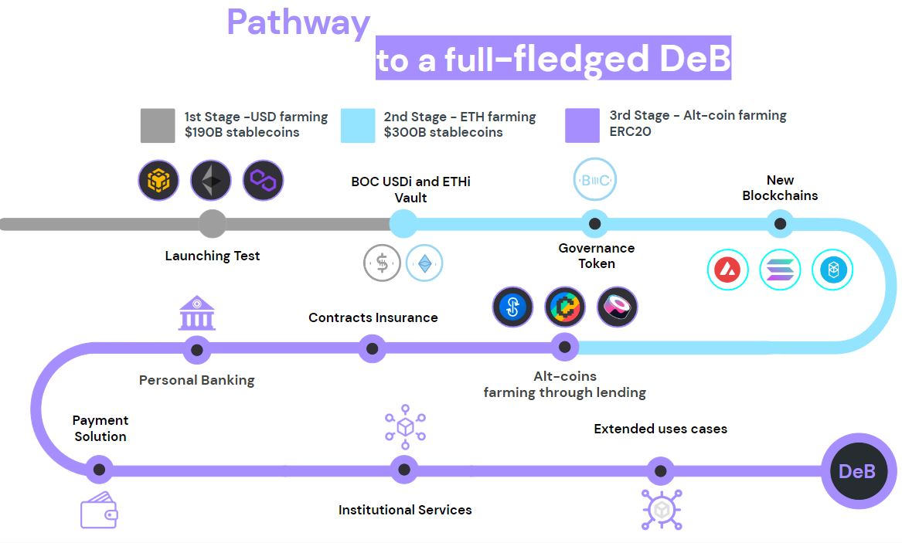

# Development Planning

## Roadmap

## Future Planning

### Algorithm Optimization

At present, the adjustment algorithm only uses a function of scipy “minimize”. Global optimization, non-convex optimization, among other algorithms can be considered.

### Additional Mainstream Blockchains

In the future, BOC may support more blockchains networks, such as Fantom, Avalanche, Solana, Arbitrum, etc.

### Additional Protocol Strategy

In the future, BOC may support more protocol strategies with stable and competitive profit.

### Loan Protocol Support

By introducing a loan protocol, a liquidity pool is provided for BOC, and the leverage agreement can be accessed for strategic investment in the future. BOC introduces a lending protocol to add leverage when docking the protocol strategy, monitor the relationship between market-making yield, mining coin yield and lending rate in real time, and dynamically adjust the leverage multiple.

### Fiat Deposit Channels Support

1. Support bank account deposits and withdrawals;
2. Support credit card deposit and withdrawal;
3. Support payment software deposits and withdrawals;

### BOC debit card.

BOC will have its own Debit Card for all their users.

### Non-stablecoin Financial Management

1. Support ETH farming and financial management.
2. Support non-mainstream currency farming and financial management.
