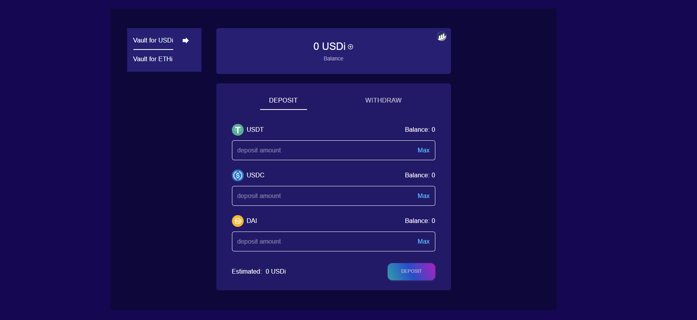
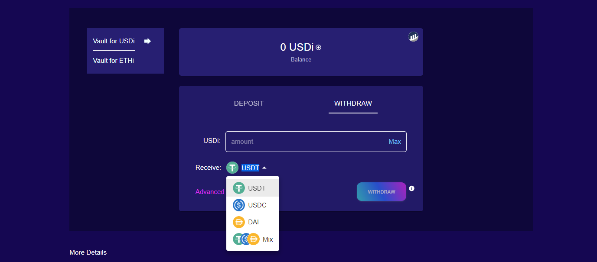
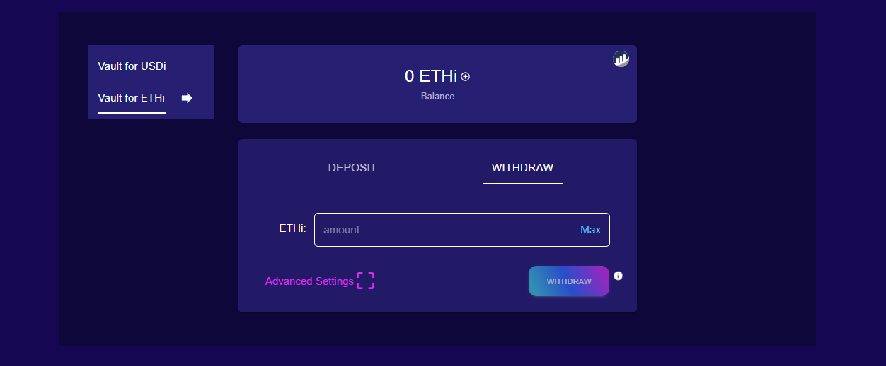

# User Handbook

Here is a quick guide to interact and invest with the BOC platform. First, to complete the investment in BOC we need to start on the user investment page. We go to the [home page](https://bankofchain.io/#/) and click on `LAUNCH APP` button.

## Wallet Connection

We can interact with BOC through [wallets](../more/appendix.md#wallet), the APP is compatible [MetaMask](https://metamask.io/) and [WalletConnect](https://walletconnect.com/), by clicking on the `CONNECT WALLET` button.

After connecting the wallet, we can see the USDT balance in our account.

## Parameter Settings

### Cross-chain Bridge

BOC provides [cross-chain bridge](../more/appendix.md#bridge) options, in case it's necessary to do cross-chain operations.

### Switch Chain

At the present, BOC works on Ethereum, BNB Chain and Polygon. If we need to switch chains, they can do it through `NETWORKS`.

## Investment and Redemption

### Deposit

Once the wallet has been successfully connected, we can complete the deposit by choosing the vault we what to use, on the `USDi Vault` we will have the stablecoin to use and selecting the desired amount and then clicking on `DEPOSIT`.

On the `ETHi Vault` we will have the possibility of investing ETH by selecting the desired amount and then clicking on `DEPOSIT`.

The `ETHi Vault` differently to the `USDi Vault` has a gas fee estimation.

### Withdrawal

After successfully connecting the wallet, we can complete the withdrawal by selecting vault we what to do use, on the `USDi Vault` is the possibility to withdraw a single stablecoin or mix we complete with the desired USDi and clicking `WITHDRAW`.

On the `ETHi Vault` there is the possibility to withdraw only ETH we complete with the desired ETHi and clicking `WITHDRAW`.

**Exchanged**: Exchange function enablement. Each strategy in the BOC uses different stablecoins. When we withdraw money, we will do it according to the strategy APY from low to high. If a non-USDT strategy is obtained, the stable currency of the corresponding strategy will be returned, e.g. if Yearn LUSD is obtained, LUSD will be returned and if the exchange is closed, the corresponding value of LUSD will be returned to our account. If redemption is enabled, the Slippage parameter needs to be set.

### Withdrawal Advanced Parameters

The advanced setup parameters are:

**Max Loss**: The maximum loss on withdrawals. When we specify the amount of USDi to withdrawal, the total assets at the current net value will be displayed, but these are not the funds we can finally get, and losses may occur during the withdrawal process, including exchange slippage losses. If our total assets are estimated to be $1000 at this time, and we choose Max Loss=0.3%, then we will get no less than $997.

**Slippage**: [Slippage](../more/appendix.md#slippage) between different currencies. After enabling Exchanged, we need to specify the slippage that we accept.

### Adding USDi and ETHi to your wallet

If the USDi is not shown on your wallet, you need to add it manually, we make it really easy you just to click on the `+` next to your USDi balance and press `Add Token`. Then you will see you USDi balance on your metamask wallet.

<!-- It´s neccesary to delete this line to run locally, but notice that works when it´s upload. -->
 

Analogously, ETHi can be added to the wallet in the same way.

## Dashboard

From the [dashboard](../more/appendix.md#dashboard) we can get the next relevant information about our assets and protocols that interact with them.

[https://dashboard.bankofchain.io](https://dashboard.bankofchain.io)

Each data is described as follows:

1. On-chain Vault lock-up amount, read the subgraph interface.
2. The number of investment users, read the subgraph interface.
3. APY for the last 30 days based on net worth.
4. Proportion of protocol funds, query the subgraph interface.
5. The total assets of each strategy, read the contract interface.
6. Official APY, regularly pulled every morning.
7. Currency standard weekly profit, weekly APY.
8. Strategy Address.
9. Vault operation records, displayed with the blockchain browser.

BOC subgraph:

* ETH: [https://api.thegraph.com/subgraphs/name/bankofchain/boc-subgraph-eth](https://api.thegraph.com/subgraphs/name/bankofchain/boc-subgraph-eth)
* BNB: [https://api.thegraph.com/subgraphs/name/bankofchain/boc-subgraph-bsc](https://api.thegraph.com/subgraphs/name/bankofchain/boc-subgraph-bsc)
* POLYGON: [https://api.thegraph.com/subgraphs/name/bankofchain/boc-subgraph-matic](https://api.thegraph.com/subgraphs/name/bankofchain/boc-subgraph-matic)

## Strategy Details

Take SushiUsdcUsdtStrategy as an example, enter the strategy details page as shown in the figure:

Each data is described as follows:

1. Strategy Details
   * Strategy name
   * Stablecoins accepted by the strategy
   * The current total assets of the strategy (valued in USDT)
   * The total assets of the strategy's historical investment (valued in USDT)
2. Strategy Historical Return APY Performance
   * Historical official APY(yellow line)
   * Historical weekly APY(blue line)
3. Total Strategy Assets (Currency Standard)
4. Strategy operation asset changes (currency standard)
5. Strategy Action Type
   * “harvest:: The strategy completes a mine sale and reinvestment, and reports the total asset valuation
   * “lend”: Vault puts funds into the strategy, and this action occurs in fund allocation (“doHardWork”, “allocation”)
   * “redeem”: Vault withdraws funds from the strategy, and this action occurs in the allocation of funds (“allocation”)

## Personal Investment Analysis

Enter the personal investment analysis page to see the personal investment income.

 Each data is described as follows:

1. Personal investment total asset valuation (calculated in USDT).
2. Acquired BOC share.
3. Pass 30 days [APY](../more/appendix.md#annual-yield-apy).
4. Unwithdrawn earnings (calculated in USDT).
5. Withdrawn earnings (calculated in USDT).
6. Historical personal total assets.
7. Monthly income.
