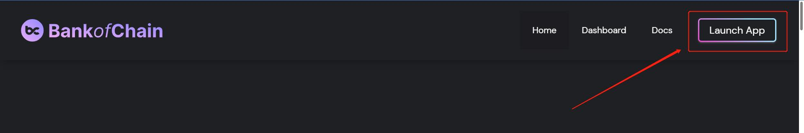
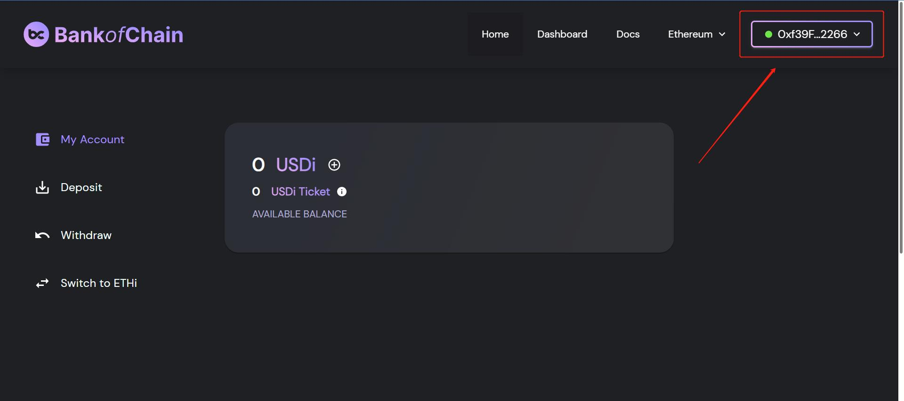
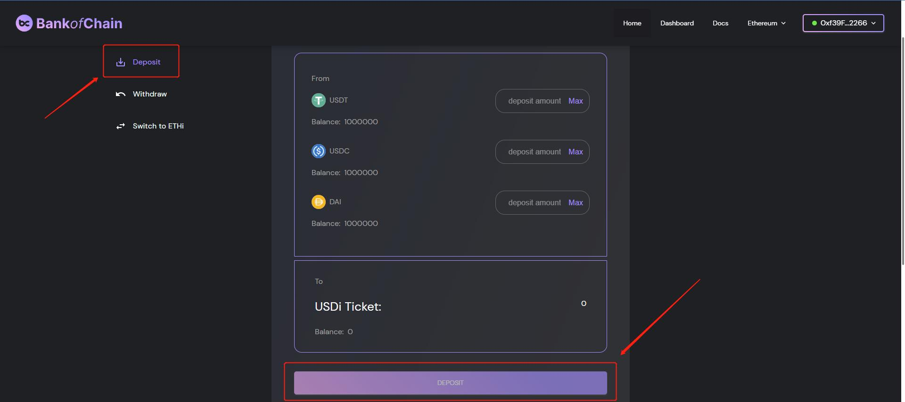
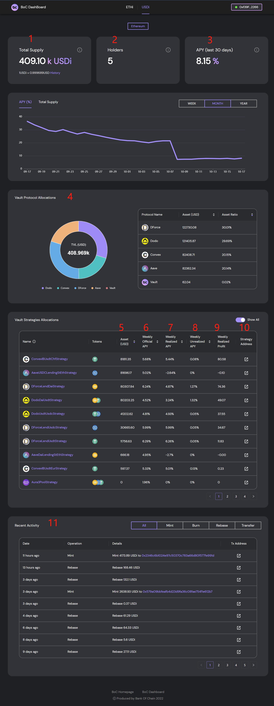
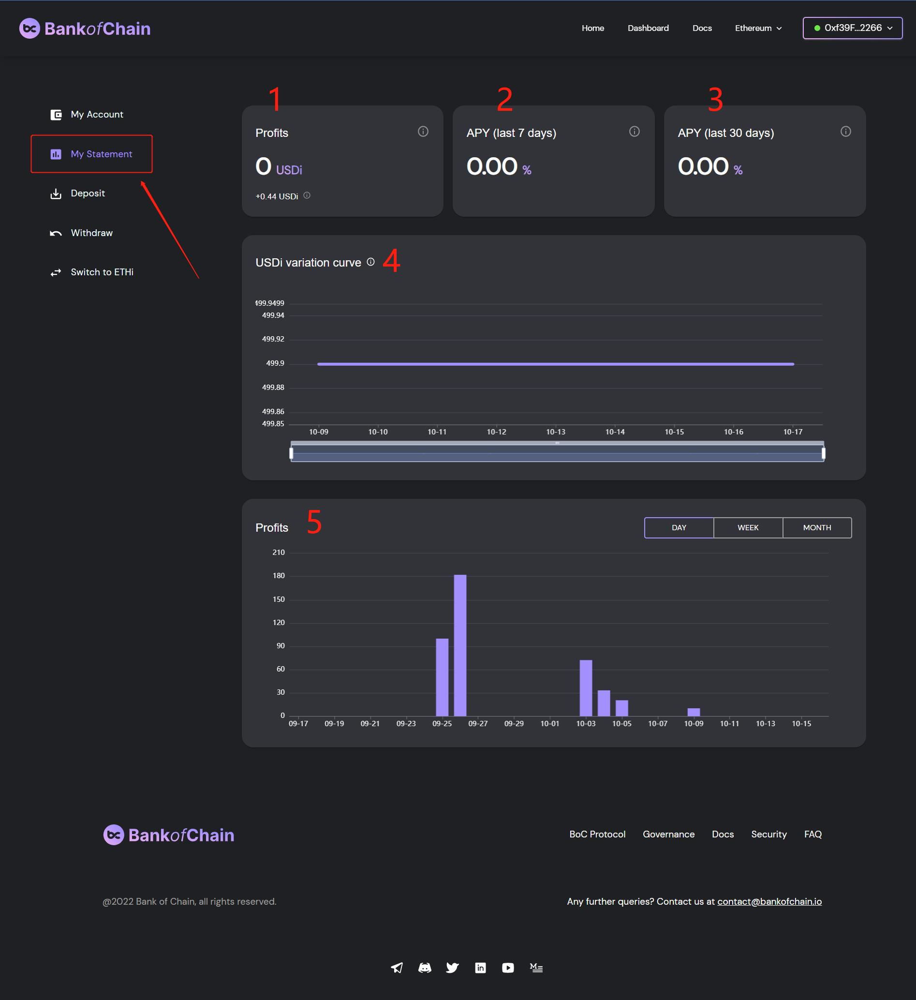

# User Handbook

## User Handbook

Here is a quick guide on interacting and investing with the BoC platform. To complete the investment in BoC, we first start off from the user investment page. Go to the [home page](https://bankofchain.io/#/) and click on the `LAUNCH APP` button. You will now be directed to the main page of the APP.

<figure><figcaption>
Figure 1: Launch App
</figcaption></figure>

### Wallet Connection

We can interact with BoC through [wallets](../more/appendix.md#wallet). The APP is compatible with [MetaMask](https://metamask.io/) and [WalletConnect](https://walletconnect.com/). By clicking on the `CONNECT WALLET` button, your wallet could be connected.

<figure><figcaption>
Figure 2: Connect Wallet
</figcaption></figure>

If your wallet has been successfully connected, your wallet address will appear on the `CONNECT WALLET` button.

<figure><figcaption>
Figure 3: Wallet successfully connected, with the wallet address being displayed.
</figcaption></figure>

### Parameter Settings

#### Switch Chain

At present, BoC works on Ethereum chain only. The deployment of Polygon chain is currently under progress. Once Polygon has been deployed, if chain switching is required, this could be carried out by clicking on `NETWORKS` to select the desired chain to be switched to.

<figure><figcaption>
Figure 4: Chain switching.
</figcaption></figure>

### Investment and Redemption

#### Deposit

Once your wallet has been successfully connected, you can deposit by entering the desired amount of any combinations of the stablecoin. The figure below uses `USDi Vault` as an example. Under the `DEPOSIT` tab, we have the stablecoins to be used (USDT, UTDC & DAI). By entering the desired amount for each and clicking on `DEPOSIT`, depositing is hence completed.

<figure><figcaption>
Figure 5: BoC depositing page.
</figcaption></figure>

To demonstrate, we will deposit 100 USDT, 100 USDC and 100 DAI into the protocol. The steps are illustrated by the four screenshots as follows:

<figure><figcaption>
Figure 6: Enter the desired amount for each type of stablecoins.
</figcaption></figure>

After hitting the `DEPOSIT` button, proceed to the next step to obtain the USDi ticket and to reconfirm the deposit amounts.&#x20;

<figure><figcaption>
Figure 7: <strong></strong> Confirmation window for deposit.
</figcaption></figure>

After hitting `CONTINUE`, the METAMASK window appears, displaying the approved amount, protocol address and other related details for confirmation. This process repeats for each stablecoins (USDT, USDC and DAI). The figure here shows that of USDT.

<figure><figcaption>
Figure 8: METAMASK window for transaction and gas fee approval.
</figcaption></figure>

After confirming on the details, you shall be redirected to the deposit main page. If the stablecoins have been successfully deposited into the Vault, your current balance of each stablecoin should be updated and displayed as shown. The BoC protocol will allocate your funds into third-party protocols based on the fund allocation rules, which prioritizes liquidity pool of higher yields and adjusts automatically to ensure the most cost-efficient position. During this allocation process, your USDi ticket balance will be shown on-screen.

<figure><figcaption>
Figure 9: USDi ticket balance during fund allocation.
</figcaption></figure>

After the fund allocation, the protocol exchanges the USDi ticket for USDi. After deducting the first allocation fee, USDi will then be distributed into your account, with the balance now viewable.

By hitting the `Switch to ETHi` tab, users will be directed to the ETHi Vault page for ETH depositing.

<figure><figcaption>
Figure 10: Switching to ETHi
</figcaption></figure>

The figure below illustrates the ETHi page for depositing:

<figure><figcaption>
Figure 11: ETHi depositing page
</figcaption></figure>

As on the ETHi Vault, you could only invest ETH by entering the desired amount and clicking on `DEPOSIT`. The main difference between the ETHi Vault and the USDi Vault is that the former has a gas fee estimation, as shown in the figure above.

#### Withdrawal

After successfully depositing and ensuring that your wallet remains connected, you are now prepared to withdraw your funds. For instance on the USDi Vault, there is an option to either withdraw a single type of stablecoin or mixed. You are also required to enter the desired amount of each stablecoin to withdraw or you could simply select `Max` to withdraw all funds. After all parameters were entered correctly, you then proceed and click `WITHDRAW`.

To demonstrate, we will withdraw all USDi into USDC by selecting `MAX` and hit `WITHDRAW` :

<figure><figcaption>
Figure 12: Withdraw all USDi from BoC vault.
</figcaption></figure>

After hitting `WITHDRAW` the METAMASK window appears, displaying details such as the estimated gas fee for confirmation.

<figure><figcaption>
Figure 14: METAMASK window for gas fee approval.
</figcaption></figure>

After confirming on the details, you will be redirected to the withdrawal main page. You can then check to confirm whether withdrawal was successful by referring to the updated USDi balance.

Since all USDi were withdrawn, the USDi balance will appear as zero here:

<figure><figcaption>
Figure 15: USDi balance being shown on screen.
</figcaption></figure>

After withdrawing has completed, there will be a pop-up window allowing users to swap tokens to the ones they desire:&#x20;

<figure><figcaption>
Figure 16: Pop-up window for tokens swapping
</figcaption></figure>

Users will be required to enter their slippage tolerance between different token currencies.

By hitting `SWAP` , the METAMASK window appears, displaying details such as the estimated transaction fee and permission request for confirmation.

<figure><figcaption>
Figure 17: METAMASK window confirming transaction fee for tokens swapping.
</figcaption></figure>

By hitting the `Switch to ETHi` tab, users will be directed to the ETHi Vault page for ETH withdrawal.

<figure><figcaption>
Figure 18: Switching to ETHi
</figcaption></figure>

The figure below illustrates the ETHi page for withdrawal:

<figure><figcaption>
Figure 19: ETHi page
</figcaption></figure>

**Exchanged**: Exchange function enablement. Each strategy in the BoC uses different stablecoins. Money is always withdrawn according to the strategy APY from low to high. If a non-USDT strategy is obtained, the stable currency of the corresponding strategy will be returned, e.g., if Yearn LUSD is obtained, LUSD will be returned and if the exchange is closed, the corresponding value of LUSD will be returned to your account. If redemption is enabled, the Slippage parameter needs to be set.

#### Withdrawal Advanced Parameters

<figure><figcaption>
Figure 20: Withdrawal advanced parameter (Max Loss)
</figcaption></figure>

The advanced setup parameters are:

**Max Loss**: The maximum loss on withdrawals. When we specify the amount of USDi to withdraw, the total assets at the current net value will be displayed, but these are not the funds that we would obtain eventually. Losses might also occur during the withdrawal process. These include the exchange slippage losses. If our total assets are estimated to be $1000 currently, and we choose the Max Loss to be 0.3%, then we will gain at least $997.

#### Adding USDi and ETHi to your wallet

If the USDi tokens deposited are not visible in your wallet, you will be required to import the tokens manually. As illustrated in the figure below, hit the `+` sign followed by `Add Token`.

<figure><figcaption>
Figure 21: Add USDi tokens manually.
</figcaption></figure>

See here for detailed tutorials:



Analogously, ETHi can also be added to the wallet by following the same procedure.

<figure><figcaption>
Figure 22: Add ETHi tokens manually.
</figcaption></figure>

### Dashboard

From the [dashboard](../more/appendix.md#dashboard) you could obtain the next relevant information regarding your assets and protocols that interact with them.



<figure><figcaption>
Figure 23: BoC Dashboard
</figcaption></figure>

The data presented are described as follows:

1. On-chain Vault lock-up amount, read from the subgraph interface.
2. The number of investment users, read from the subgraph nterface.
3. APY for the last 30 days based on net worth.
4. Proportion of protocol funds, queried from the subgraph interface.
5. The total assets of each strategy, read the contract interface.
6. Official APY, regularly pulled weekly.
7. APY from the harvest realized in the past 7 days.
8. APY from the unharvested profits in the past 7 days.
9. Weekly profit generated by the corresponding strategy, obtained after harvest has been executed.
10. Strategy Address.
11. Vault operation records (of recent activities), displayed with the blockchain browser.

BoC subgraph:

* ETH: [https://api.thegraph.com/subgraphs/name/bankofchain/boc-subgraph-eth](https://api.thegraph.com/subgraphs/name/bankofchain/boc-subgraph-eth)
* BNB: [https://api.thegraph.com/subgraphs/name/bankofchain/boc-subgraph-bsc](https://api.thegraph.com/subgraphs/name/bankofchain/boc-subgraph-bsc)
* POLYGON: [https://api.thegraph.com/subgraphs/name/bankofchain/boc-subgraph-matic](https://api.thegraph.com/subgraphs/name/bankofchain/boc-subgraph-matic)

### Strategy Details

Using ConvexIBUsdtCHfStrategy as an example, enter the strategy details page as shown in the figure:

<figure><figcaption>
Figure 24: BoC strategy page
</figcaption></figure>

The data presented are described as follows:

1. Strategy information:
   * Strategy name.
   * Stablecoins/Tokens accepted by the strategy.
   * The current total assets of the strategy (valued in USD).
   * The current status of the strategy.
2. Strategy historical return APY performance:
   * Historical official weekly APY(purple line).
   * Historical weekly APY(green line).
3. Value locked by the strategy (daily/weekly).
4. Profits generated by the strategy.
5. Official APY of the strategy.
6. APY measured by BoC.
7. Total strategy assets (currency standard).
8. Strategy operation asset changes (currency standard).
9. Strategy operation date.
10. Position details.

### Personal Investment Analysis

On the main page, go to `My Statement` to view the personal investment profits and other details:

<figure><figcaption>
Figure 25: My Statement page
</figcaption></figure>

The data presented are described as follows:

1. Withdrawable profit in the BoC Vault gained after harvest (calculated in USDi).
2. Last 7 days [APY](../more/appendix.md#annual-yield-apy).
3. Last 30 days APY.
4. USDi variation curve displaying the USDi amount on each day.
5. Daily/ Weekly/ Monthly profits.

## Withdrawal of funds from BoC Alpha version UI.

In September 2022, the BoC Beta version will be deployed, indicating that USDi holders will be required to withdraw all of their funds from the BoC Alpha version and redeposit into the BoC Beta version. Here is the tutorial on how to withdraw your funds from the BoC Alpha version.


