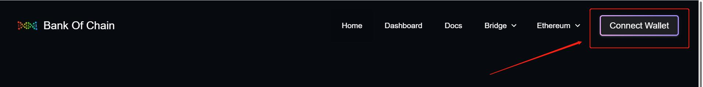
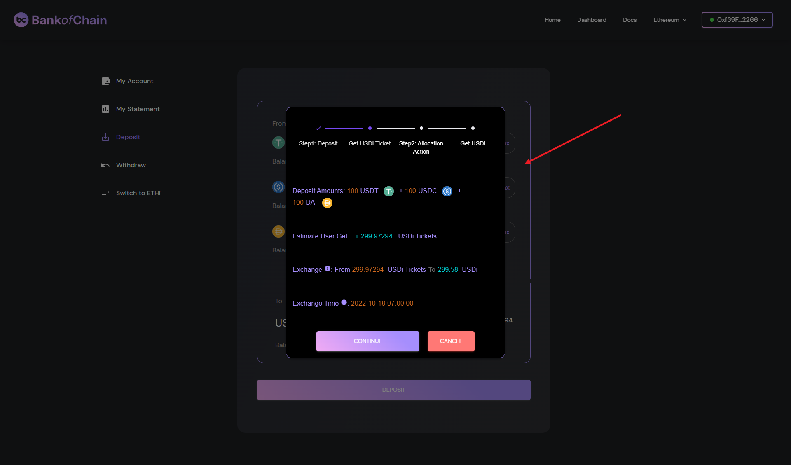
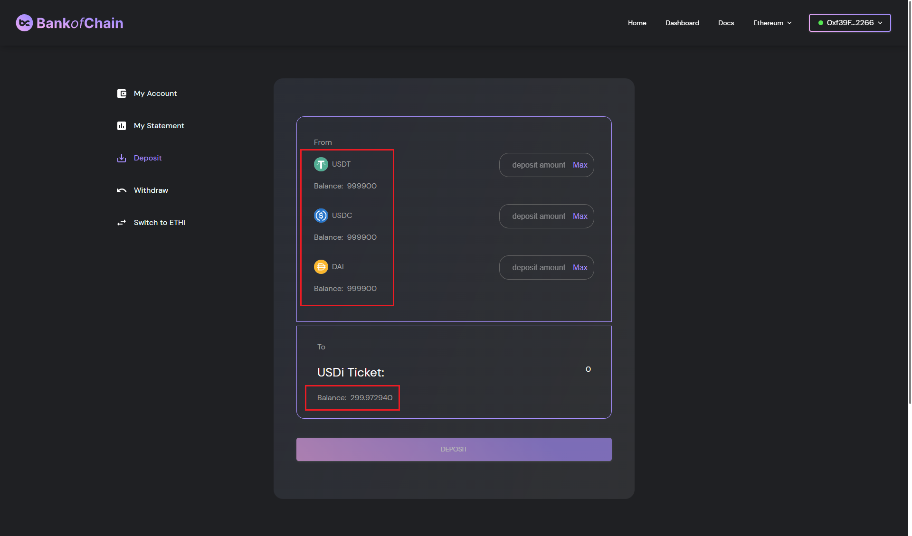
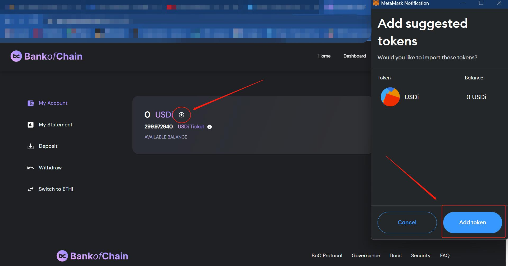

# 如何使用BoC

进入 BoC [首页](https://bankofchain.io/#/)，点击 `LAUNCH APP` 按钮进入[用户投资页](https://v1.bankofchain.io/#/invest)。

<figure><figcaption></figcaption></figure>

## 连接钱包

您可以通过 [MetaMask](https://metamask.io/#/) 和 [WalletConnect](https://walletconnect.com/#/) 与BoC进行交互, 点击 `CONNECT WALLET`按钮连接您的[钱包](../more/appendix.md#wallet)。

<figure><figcaption></figcaption></figure>

成功连接钱包后，`CONNECT WALLET` 按钮上将出现您的相关钱包地址。

<figure><figcaption></figcaption></figure>

## 参数设置

### 跨链桥

BoC提供 [Polygon](https://wallet.polygon.technology/#/) 和 [Binance](https://www.binance.com/#/) 两种[跨链桥](../more/appendix.md#bridge)，方便您实现加密资产跨链。点击页面左上方的 `Bridge`即可选择跨链桥。

<figure><figcaption></figcaption></figure>

### 切换链

BoC 提供 Ethereum、BNB Chain 和 Polygon 三条链，进入页面左上方的 `NETWORKS`中即可切换。

<figure><figcaption></figcaption></figure>

## 存币 & 取币

### 存币

目前BoC支持用户将手中的三大稳定币（USDT、USDC、DAI）以任意组合、任意数量的形式存入。成功连接钱包并且设置好参数之后，选择期望存入的池，下图以 USDi Vault 为例，在相应的币下输入您期望的存币金额，或选择 `Max`，即存入您钱包中的所有此种代币，点击`DEPOSIT`，完成存币。

<figure><figcaption></figcaption></figure>

接下来将以存入10000 USDT，20000 USDC 以及 30000 DAI 为例，存入步骤将由以下四张图表示：

**图一：**在相应的币下输入相对应的存币金额。

<figure><figcaption>
图一
</figcaption></figure>

**图二：**点击 `DEPOSIT` 按钮后，即将进入下一个步骤，获取 USDi 券并再次确认存入金额。

<figure><figcaption>
图二
</figcaption></figure>

**图三：**点击 `CONTINUE` 继续后，页面将跳转到 METAMASK 窗口，该窗口将显示批准金额以及合同地址等详情以供确认。

<figure><figcaption>
图三
</figcaption></figure>

**图四：**确认之后，页面将重新跳转到存币主页。成功存币之后，该页将显示各币相对应的余额。BoC 协议将根据资金分配规则把资金投入到第三方协议。BoC 将资金优先分配到高收益的资金池，并定期进行收益评估以对资金进行优化配置。您所兑换的 USDi 券总数将会被显示在屏幕上直到资金分配完成。扣除资金首次分配费用后，BoC 将 USDi 券兑换成 USDi 并将其发行。您的账户上才会出现当前所持有的 USDi 余额。

<figure><figcaption>
图四
</figcaption></figure>

用户也可以点击 `Switch to ETHi` 按钮跳转到 ETHi Vault 页面中存入 ETH。

<figure><figcaption></figcaption></figure>

下图为 ETHi 存币页面的截图：

<figure><figcaption></figcaption></figure>

在 ETHi Vault 中的 `Deposit` 页面，您只能输入 ETH 的存币金额并点击`DEPOSIT`。ETHi Vault 和 USDi Vault 最大的区别在于，前者将抽取一部分的燃料费，如上图中的 Estimated Gas Fee。

### 取币

成功存币后，您可以随时将USDi换回三大稳定币（USDT、USDC、DAI），也可以指定换回某一种币。取币前，您可以从 Balance 获知您现有的USDi数额。点击 `WITHDRAW` 切换到取币页面，选择池和期望换回的币种，输入需要的取币金额，或选择 `Max` 全部取出。在把所有的参数选择好后，如下图点击 `WITHDRAW` ，完成取币。

<figure><figcaption></figcaption></figure>

接下来将以提取 40000 USDi 换回 USDC 为例，取币步骤将由以下三张图表示：

**图一：**把想提取的 USDi 数额设到 40000，并选择 USDC 为提取币，随后点击 `WITHDRAW`提取。

<figure><figcaption>
图一
</figcaption></figure>

**图二：**页面将跳转到 METAMASK 窗口，以让您确认燃料费等详情。

<figure><figcaption>
图二
</figcaption></figure>

**图三：**点击确认之后，页面将重新跳转到取币的主页，您可以从 USDi 余额确认取币是否成功。

<figure><figcaption>
图三
</figcaption></figure>

用户也可以点击 `Switch to ETHi` 按钮跳转到 ETHi Vault 页面中取出 ETH。

<figure><figcaption></figcaption></figure>

下图为 ETHi 取币界面的截图：

<figure><figcaption></figcaption></figure>

#### 取币的高级参数设置

<figure><figcaption></figcaption></figure>

取币的高级参数为：

1. **Max Loss 取币最大损失**：当您输入取币数额后，会显示当前净值下的预估总资产，但这并不是您最终能拿到手的资金，在取款过程可能会发生损失，比如滑点损失。例如：此时您的总资产预估为 $1000，选择 Max Loss = 0.3%，则您拿到手的资金不会少于 $997。
2. **Slippage 滑点**：指买方和卖方预期之间的价格差异。滑点可能导致资产的最终出售价格高于或低于请求的交易金额。您需要选择或输入所能接受的滑点。

## 将 USDi 添加至钱包

在您成功存币后，如果您的钱包中没有显示 USDi，您需要手动将 USDi 添加至钱包，以方便看到当前 USDi 余额。如下图所示，点击 `+`按钮，再点击 `Add Token`, 添加完成。

<figure><figcaption></figcaption></figure>

点击此处观看 [视频教程](https://youtu.be/53kB-HakZCk) 。

ETHi 可以用相同的方法被加至钱包

<figure><figcaption></figcaption></figure>

## Dashboard

用户可以从[Dashboard](https://dashboard-v1.bankofchain.io/#/)中获得关于其资产和与资产交互的协议的所有相关信息。

<figure><figcaption></figcaption></figure>

各个数据说明如下：

1. 链上Vault锁仓量，数据通过读取subgraph接口取得。
2. 投资用户数，数据通过读取subgraph接口取得。
3. 根据最近30天的净值计算出来的APY。
4. 协议资金占比，数据通过读取subgraph接口取得。
5. 各策略总资产，读取合约接口。
6. 官方APY，每周定时拉取。
7. 近7日由已收割 (harvest) 收益计算出的 APY。
8. 近七日未收割 (unharvested) 收益计算出的 APY。
9. &#x20;收割完成后该策略所生成的每周收益。
10. 策略地址。
11. Vault操作记录，同区块链浏览器展示。

BOC subgraph：

Ethereum：[https://api.thegraph.com/subgraphs/name/bankofchain/boc-subgraph-eth](https://api.thegraph.com/subgraphs/name/bankofchain/boc-subgraph-eth)

BNB Chain：[https://api.thegraph.com/subgraphs/name/bankofchain/boc-subgraph-bsc](https://api.thegraph.com/subgraphs/name/bankofchain/boc-subgraph-bsc)

Polygon：[https://api.thegraph.com/subgraphs/name/bankofchain/boc-subgraph-matic](https://api.thegraph.com/subgraphs/name/bankofchain/boc-subgraph-matic)

## 策略详情页

以UniswapV3UsdcUsdt500Strategy为例，提供了策略的详情，进入[策略详情页](https://dashboard.bankofchain.io/#/strategy?id=0x4717eaa5da97f11bda3a3f021a20fd8cb72eab64\&chain=137)如图：

<figure><figcaption></figcaption></figure>

各个数据说明如下：

1. 策略详情：
   * 策略名称。
   * 策略接收的稳定币种。
   * 策略当前总资产（以USD估值）。
   * 策略当前状态（上架Vault/下架Vault）。
2. 策略历史收益APY表现：
   * 历史Official 每周APY（紫线）。
   * 历史Weekly APY（绿线）。
3. 策略锁仓（每日/每周）。
4. 策略所生成收益。
5. 策略官方 APY。
6. 由BoC 测量核实的 APY。
7. 策略操作资产变动（币本位）。
8. 策略总资产（币本位）。
9. 策略操作日期。
10. 策略位置详情。

## 个人投资分析页

进入[个人投资分析页](https://dashboard.bankofchain.io/#/mine?chain=1)可以看到个人投资收益。

<figure><figcaption></figcaption></figure>

各个数据说明如下：

1. 个人 USDi 余额
2. 策略里未收割但已生成的收益，一旦收割完成后将转换成已实现收益（以 USDi 计算）。
3. 收割完成后，BoC机枪池中用户可提取的收益（以 USDi 计算）。
4. 近7日 APY。
5. 近30日 APY。
6. 每日 USDi 数额。
7. 月收益。

## 从BoC内测版UI中取币

2022年9月，BoC将推出公测版，因此将重新部署USDi合约。故此，BoC希望用户配合将所有已投入资金取出，并重新投资到公测版中。以下为取币相关视频教程：


