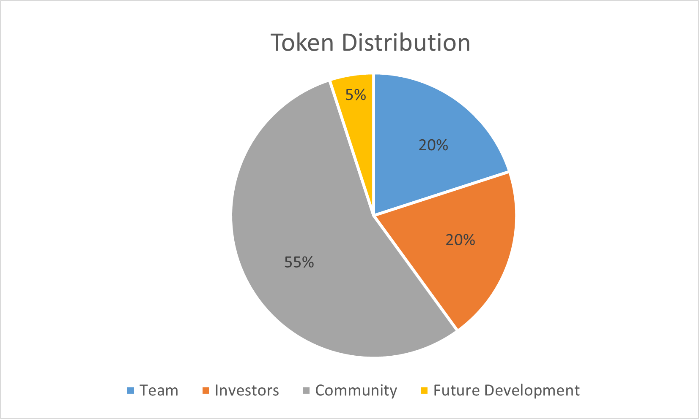

# Governance

BOC is a disruptive blockchain innovation that aims to change the DeFi ecosystem. It will serve as a bridge between fund lenders and investment operators. BOC will be a gate to newcomers on the crypto investing world, creating a new way to interact with the DeFi Ecosystem.

## DAO Development

At present, the governance of BOC is through Gnosis multi-signature. In the future, governance will be assumed by DAO.

DAO will use governance forum and snapshot for off-chain voting, and the execution proposals by on-chain smart contracts. The links are as follows:  
BOC [snapshot](https://snapshot.org/#/bankofchain.eth)  
BOC [Forum](https://governance.bankofchain.io/)
  
The Governance tokens are yet to be developed but they will be launched soon.

## Tokenomics

The maximum supply of BOC tokens is 1 billion. Tokenholders will receive a BOC management fee according to the holding ratio. After the tokens are locked, they can participate in governance and share the benefits. The specific tokens are planned to be distributed in the following 4 parts: team, investors, community and reserved part.

| **Team**                                                                                         | **20.00%**  | **200M** |
| ------------------------------------------------------------------------------------------------ | ----------- | -------- |
| Technology Team                                                                                  | 10.00%      | 100M     |
| Sales & Marketing                                                                                | 2.00%       | 20M      |
| Founders                                                                                         | 8%          | 80M      |
| **Investors**                                                                                    | **20.00%**  | **200M** |
| \*\*Community \*\*                                                                               | **55.00%**  | **550M** |
| Liquidity from DEX (USD trading on Balancer for 12 months)                                       | 5.00%       | 50M      |
| Liquidity Mining (increased returns for investors in the early stage, for a period of 12 months) | 50.00%      | 500M     |
| **Future Development**                                                                           | **5.00%**   | **50M**  |
| Team (recruit new team members in the future)                                                    | 3.00%       | 30M      |
| Consultants (important and influential people in the industry)                                   | 2.00%       | 20M      |
| \*\*Total \*\*                                                                                   | **100.00%** | **1B**   |

\*Note: The total percentage will be 10% in the first year, 20% in the second year, 30% in the third year, and 40% in the fourth year

## Audit

All BOC smart contracts are audited by independent high-rated auditors.

## Bug Bounty Program

By collaborating with third parties, BOC will establish a way in which the community will help to improve the quality of the smart contracts used. Potential third-party organizations include the premier bug bounty platform and the DeFi Project. In those organizations, security researchers review code, disclose vulnerabilities, have the incentive in making smart contracts more secured.
