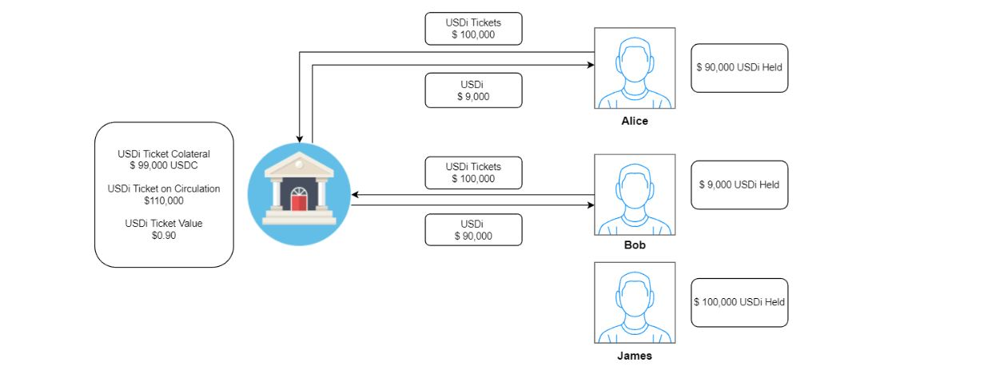

# Protocol Algorithm Design

BOC provides the [USD Stablecoins Farming](https://github.com/Francisco-Rua/boc\_gitbook/blob/master/how-it-works/Protocol-Algorithm-Design/README.md#usd-stablecoins-farming-mechanism) and [ETH Farming](https://github.com/Francisco-Rua/boc\_gitbook/blob/master/how-it-works/Protocol-Algorithm-Design/README.md#eth-farming).

## USD Stablecoins Farming Mechanism

### Process Description

<figure><figcaption></figcaption></figure>

1. “Deposit” - The BOC protocol supports users with the `deposit` function - to deposit the three major stablecoins (USDT, USDC, DAI) in any desired combination and amount. BOC also allows minting of USDi of the corresponding value to be returned to the user.\
   “Withdraw” - Users can `withdraw` USDi which consists of the three major stablecoins at their convenience through the BOC protocol. By default, they will be returned according to the proportion of the three major stablecoins in the [Vault](../more/appendix.md#vaults) at that time, or they can specify a certain currency to be returned.
2. After the Vault receives the stablecoin, `queryTokenPrice` queries the price of the user's transfer of the [stablecoin](../more/appendix.md#stablecoin) through an external oracle. When the price returned by the [oracle](../more/appendix.md#oracle) is higher than 1 USD, it is calculated at 1 USD, whereas while it is lower than 1 USD, it is calculated at the price of the oracle.
3. Based on the calculated value, `mint/burn` will [mint/burn](../more/appendix.md#burnmint) an equivalent value of USDi tickets.
4. The [Keeper](../more/appendix.md#keeper) module reaches the trigger condition `doHardWork` and triggers `doHardWork`.
5. After the Keeper trigger `doHardWork` the vault allocates the funds and exchanges the USDi (burn) tickets for USDi (mint)
6. Vault calls the aggregate exchange module `swapTokenToWants`.
7. The aggregated exchange module `swapTokens` completes the exchange.
8. Vault receives the targetted currency exchanged by the aggregate exchange module.
9. Vault puts stablecoin `deposits` into the strategy according to the currency required by the strategy.
10. The [strategy](../more/appendix.md#strategy) invests stablecoin `deposits` into third-party protocols.
11. The Keeper module reaches the `harvest` trigger condition and triggers the `harvest`.
12. Harvester triggers each strategy to execute `harvest`.
13. Each strategy executes `claimRewards` to collect mining.
14. Each strategy transfers mining coins `transferRewards` to Harvester.
15. Harvester sells miners `sellRewards` into stablecoins through the aggregated exchange.
16. Harvester `sendProfitToVault` transfers stablecoins into Vault.
17. The Keeper module reaches the `rebase` trigger condition and triggers the `rebase`.
18. Vault calls `changeTotalSupply` to issue additional USDi.
19. Vault collects 20% of the yield, which is transferred to the `Treasury`.
20. The [treasury](../more/appendix.md#daos-treasury) will benefit users by using `buyback` to repurchase the BOC governance token.

### Mint & Burn rules

Here is a numerical example of minting and burning USDi tokens.

Assume that Alice deposits 100 USDT, 100 DAI and 100 USDC.

According to the BOC mint rule: the transaction price is 1 USD when the price from Chainlink is higher than 1 USD. Otherwise, the transaction price is equal to the price from Chainlink.

Thus, Alice will `mint` 299 USDi in total:

The current price from Chainlink is:

* 1 USDT = 1.01 USD
* 1 DAI = 0.99 USD
* 1 USDC = 1.00 USD

100 USDT = 100 x 1.00 = 100 USDi (price of Chainlink > 1 USD final price = 1 USD)\
100 DAI = 100 x 0.99 = 99 USDi (price of Chainlink < 1 USD final price = Chainlink price)\
100 USDC = 100 x 1.00 = 100 USDi (price of Chainlink = 1 USD final price = 1 USD)

Now, Alice decides to `burn` the USDi to withdraw her stablecoins. She has 299 USDi now and when she burns depending on the proportion of USDT/USDC/DAI of the Vault. The burning smart contract will distribute the same proportion of the USDi on each stablecoin. In this case when we redeem there is slightly less USDT on the Vault, so the distribution will be 99 of them for USDT, 100 for DAI, and the rest 100 for USDC (assuming that the current price from Chainlink remains unchanged).

The rule of burning is opposite to that of minting: the transaction price is 1 USD when the price from Chainlink is less than 1 USD. Otherwise, the transaction price is equal to the price from Chainlink.

Therefore, Alice burns 299 USDi to withdraw:

Chainlink prices:

* 1 USDT = 1.01 USD
* 1 DAI = 0.99 USD
* 1 USDC = 1.01 USD

100 USDi = 100/1.01 = 99 USDT (price of Chainlink > 1 USD final price = Chainlink price)\
100 USDi = 100/1.00 = 100 DAI (price of Chainlink < 1 USD final price = 1 USD)\
100 USDi = 100/1.00 = 100 USDC (price of Chainlink = 1 USD final price = 1 USD)

The numbers in the chart here are only numerical examples for a better understanding of the rules of minting and burning in BOC. In reality, the fluctuation of USDi is much smaller, indicating that users will never encounter such possible loss. In fact, the possible loss here will be less than 0.01%. The objectives of these rules are to avoid arbitrage and to protect the protocol's vault.

### USDi Ticket

In the Alpha version, the first allocation fee for every deposit will be shared out by all users in the vault, depending on their proportion of the amount deposited. However, this analogously indicates that the first allocation fee of one user will also be borne by all other users including those who have previously deposited into the vault. So, the Beta version will include a new concept "USDi Ticket"  which is designed as a buffer that avoids USDi holders from being affected by new deposits on the protocol. Let's see both scenarios for a better explanation:&#x20;

To simplify the situation for easier understanding:

* Assume that the users only deposit in USDC
* The price on Chainlink is now `1 USDC = 1 USD`.&#x20;
* The vault is currently having only one user (James) who holds 100k USDi.&#x20;
* The allocation fee is 10% to look better at the impacts (in reality is less than 1%).

#### Alpha version logic (without USDi ticket).

We have James, he is holding at the moment  `T=0` $ 100,000 USDi being USDi a fully pegged to USD (1 USDi = 1 USD), so his total assets on USD is $100,00 USD.

<figure><figcaption>
Starting point T=0 (Alpha version).
</figcaption></figure>

Yesterday, Alice deposited 100,000 USDC as well, while Bob deposited 10,000 USDC. So, the vault will mint 110,000 USDi and they will be receiving 100,000 USDi and 10,000 USDi respectively.&#x20;

<figure><figcaption>
Alice and Bob deposit new funds on BoC protocol (Alpha version).
</figcaption></figure>

The keeper will call the funds allocation when the [conditions](protocol-algorithm-design.md#allocation) are met and the vault will allocate the fund on the strategies selected by the keeper. For this feed will be needed to pay on the 3rt party protocols to complete the allocation, this fee will be taken from the USDi collateral, causing a de-pegging.

<figure><figcaption>
Allocation of the funds T=1 (Alpha version). 
</figcaption></figure>

<figure><figcaption></figcaption></figure>

As we can see in the table, the fund allocation decreases the USDi collateral causing a de-pegging of it vs USD where James' assets have been affected by Alices' and Bob's deposit.

<figure><figcaption>
User's assets after allocation.
</figcaption></figure>

#### Beta version logic (with USDi ticket).

The Beta version is incorporated USDi ticket functions as a buffer for the dispatching of the USDi. It could also be understood as a parallel USDi. After depositing stablecoins into the vault,  the user holds USDi tickets until the fund allocation has been completed by the protocol, and then only USDi will be distributed to the user. This allows the first allocation fees to be transparent and visible, which is the difference between the USDi tickets held by the user and the USDi distributed afterward.

Again, we have James, he is holding at the moment  `T=0` $ 100,000 USDi being USDi a fully pegged to USD (1 USDi = 1 USD), so his total assets on USD is $100,00 USD.

<figure><figcaption>
Starting point T=0 (Beta version).
</figcaption></figure>

In this situation, Alice deposited 100,000 USDC as well, while Bob deposited 10,000 USDC. So, on the Beta version, the vault will mint 110,000 **USDi Tickets** and they will be receiving 100,000 USDi and 10,000 USDi respectively.&#x20;

<figure><figcaption>
Alice and Bob deposit new funds on BoC protocol (Beta version).
</figcaption></figure>

The keeper will call the funds allocation when the [conditions](protocol-algorithm-design.md#allocation) are met and the vault will allocate the fund on the strategies selected by the keeper. For this feed will be needed to pay on the 3rt party protocols to complete the allocation, this fee will be taken from the USDi collateral, causing a de-pegging.

<figure><figcaption>
Allocation of the funds T=1 (Beta version). 
</figcaption></figure>

After the fund's allocation, the vault will exchange the USDi Tickets (burn) for USDi (mint).

<figure><figcaption></figcaption></figure>

<figure><figcaption></figcaption></figure>

As we can see in the table, the fund allocation decreases the USDi Ticket collateral causing a de-pegging of it vs USD but USDi collateral remains untouched and fully pegged to USD, soJames' assets have not been affected by Alices' and Bob's deposit.

<figure><figcaption></figcaption></figure>

### Harvest

The `harvestTrigger` is triggered daily to determine whether the `harvest` conditions are met. The two conditions are:

1. Maximum time interval is exceeded.
2. The harvest rules are met:

$$
Profit \times 20\% > harvest cost
$$

If any of the above conditions are met, the strategy can perform `harvest`:

1. Execute the yield transfer Harvester (for the strategy with yield production and reach the yield selling threshold);
2. Report the current asset from the strategy.

| Set parameters                                                                                                                                                             | ETH           | BNB Chain     | Polygon       |
| -------------------------------------------------------------------------------------------------------------------------------------------------------------------------- | ------------- | ------------- | ------------- |
| Scheduled task trigger cycle                                                                                                                                               | 6:00 am daily | 6:00 am daily | 6:00 am daily |
| Maximum time interval for triggering strategie “harvest” (if the interval between current “harvest” and last “harvest” is greater than this value, “harvest” must be done) | 3 days        | 1 day         | 1 day         |
| The benefit-cost ratio factor X of the trigger strategy “harvest” (“harvest” profit>=cost\*X, then “harvest” can be done.)                                                 | 5             | 5             | 5             |

### Rebase

When the total assets of the Vault are greater than the total issuance of USDi, this indicates that new income has been generated. Hence, the value of USDi compared to the US dollar will be revised, and the number of USDi will be increased, so that the total value of USDi is consistent with the total value of Vault assets, ensuring that 1 USDi is anchored at 1 USD. Concurrently, 20% of the additional USDi will be transferred to the DAO treasury as the management fee.

### Fund Allocation

#### doHardWork

The inputs into the position adjustment of the algorithm are the official [APY](../more/appendix.md#annual-yield-apy) of the third-party protocol, the gas required for investment of each strategy, the limit of exchange [slippage](../more/appendix.md#slippage), and the [rules of fund allocation](https://github.com/Francisco-Rua/boc\_gitbook/blob/master/how-it-works/introduction-to-boc/README.md#fund-allocation-rules). Meanwhile, the strategy and amount of the funds to be invested are the outputs.

| Set parameters                                                                                           | ETH                     | BNB Chain               | Polygon                 |
| -------------------------------------------------------------------------------------------------------- | ----------------------- | ----------------------- | ----------------------- |
| Scheduled Task Trigger Cycle                                                                             | 7 am daily besides Mon. | 7 am daily besides Mon. | 7 am daily besides Mon. |
| Cost-benefit Calculation Period X (If the profit of investment X days >= cost, “doHardwork” can be done) | 365 days                | 365 days                | 365 days                |

#### Allocation

Compared with `doHardWork`, `allocation` has an additional step: it withdraws the funds of the low APY strategy, then uses the official APY of the third-party protocols, the gas required for investment of each strategy, the exchange slippage limit, fund allocation rules, and the position adjustment algorithm as inputs, and the outputs are the strategy and the amount of the awaiting investment funds.

| Set parameters                                                                                            | ETH                           | BNB Chain                     | Polygon                       |
| --------------------------------------------------------------------------------------------------------- | ----------------------------- | ----------------------------- | ----------------------------- |
| Pre-adjusted position report trigger timing                                                               | every Sun. (after doHardWork) | every Sun. (after doHardWork) | every Sun. (after doHardWork) |
| Scheduled task trigger cycle                                                                              | 7 am every Monday             | 7 am every Monday             | 7 am every Monday             |
| Cost-benefit calculation period X (If the profit of rebalancing X days >= cost, “allocation” can be done) | 30 days                       | 30 days                       | 30 days                       |

#### Fund allocation Algorithm

| Variable       | Meaning                                                                                                                                                                                                                   |
| -------------- | ------------------------------------------------------------------------------------------------------------------------------------------------------------------------------------------------------------------------- |
| "durationDays" | The cycle of rebalancing needs to ensure that in a cycle after rebalancing, $$the profit after rebalancing - the profit before rebalancing - the cost of rebalancing > 0$$ (has to be greater than 0)                     |
| "yearDays"     | 365days                                                                                                                                                                                                                   |
| "asset1"       | The original assets of the strategy                                                                                                                                                                                       |
| "apr1"         | The strategy apr before the position adjustment (APY needs to be converted into apr). The current value of the APY of the position adjustment algorithm is the 7-day average of APY calculated outside the strategy chain |
| "deltaAsset"   | Assumed as the capital change value of the strategy rebalancing                                                                                                                                                           |
| "poolAssets1"  | The TVL of the strategic target investment pool is used as a parameter for the change of apr after the position adjustment                                                                                                |

**Profit before position adjustment**

$$
gain1 = \frac{asset1 \times apr1 \times durationDays}{yearDays}
$$

**Changed earnings**

$$
gain2 = \frac{(asset1+deltaAsset-exchangeLoss)\times apr2 \times durationDays}{yearDays}
$$

**Changed apr**

$$
apr2 = \frac{apr1 \times poolAssets1}{(poolAssets1+deltaAsset-exchangeLoss)}
$$

After substituting apr2 in gain2 using the above equation:

$$
gain2=\frac{apr1 \times durationDays/yearDays \times (asset1+deltaAsset) \times poolAssets1}{poolAssets1+deltaAsset-exchangeLoss}
$$

Hence the relationship between the changed income of a single strategy and the changed assets is:

$$
deltaGain = gain2-gain1 = \frac{deltaAsset \times (poolAsset1-asset1) \times apr1 \times durationDays}{(poolAsset1+deltaAsset-exchangeLoss) \times yearDays}
$$

**Cost of changing funds for a single strategy**

| variable name    | Details                                                                                        |
| ---------------- | ---------------------------------------------------------------------------------------------- |
| withdrawFee      | Withdrawal Fund Handling Fee                                                                   |
| lendFee          | Additional capital operation fee                                                               |
| exchangeLoss     | Exchange currency slippage loss                                                                |
| harvestFee       | “harvest” Funding Fees                                                                         |
| profitChangeFee  | Capital change cost                                                                            |
| withdrawGas      | withdrawGas is the gas consumed by the “withdraw” operation, which is estimated by pre-testing |
| lendGas          | lendGas is the gas consumed by the “lend” operation, which is estimated by pre-testing         |
| exchangeLossRate | Redeem Slippage                                                                                |

$$
profitChangeFee=withdrawFee+lendFee+exchangeLoss+harvestFee
$$

$$
withdrawFee = gasPrice \times withdrawGas
$$

$$
lendFee= gasPrice \times lendGas
$$

$$
exchangeLoss=deltaAsset \times exchangeLossRate
$$

$$
harvestFee=harvestGas \times durationDays
$$

Find the maximum sum of `deltaGain` for all strategies:

$$
profitChange=MAX\sum_{i=1}^m(deltaGain_i -withdrawFee_i-lendFee_i - exchangeLoss_i-harvestFee_i)
$$

$$
profitChange=MAX\sum_{i=1}^m(\frac{deltaAsset_i \times (poolAsset_i-asset_i) \times apr_i * durationDays_i}{(poolAsset_i+deltaAsset_i-exchangeLoss_i) \times yearDays_i}
$$

$$
- operateFee_i - exchangeLoss_i - harvestFee_i)
$$

In the formula above (profitChange), the only variable is the deltaAsset for each strategy. Meanwhile, the solution needs to be limited by:

**Restrictions**

1. The same protocol strategy (multiple constraints) funds do not exceed 30% of the total funds.
2. The sum of all asset changes in and out is 0.

**Boundary conditions**

1. Strategic assets do not exceed 20% of the total assets.
2. The strategic funds do not exceed 50% of the targetted pool assets.

Use python scipy's `optimize.minimize` to find the current optimal rebalancing scheme.

#### Public Parameter Configuration

| Set parameters                                                                                | ETH                                           | BNB Chain  | Polygon    |
| --------------------------------------------------------------------------------------------- | --------------------------------------------- | ---------- | ---------- |
| Fund allocation calculation Exchange slippage settings                                        | 0.15%                                         | 0.15%      | 0.15%      |
| Gas configuration (including strategy deposit and withdrawal Gas, exchange Gas, harvest cost) | 0 (become actual gas when asset > $5 million) | Actual Gas | Actual Gas |

#### Official APY Calculation Rules

The official APY rules are needed as a reference when allocating funds. The sources of official APY are as follows: vfat.tools, coingecko, zapper, Official APY, apy.vision Fee, etc. If the APY calculation of the protocol strategy is not included in the official APY source channel, BOC will copy the official APY calculation rules of the protocol strategy. In general, the official APY of the protocol strategy consists of market-making revenue and mining coin revenue. Taking the “ConvexLusdStrategy” strategy that BOC has already docked as an example, its APY consists of the contents in following table:

| APY Mark | APR         | APY              | Compound Interest | Calculation Method   | Data Source                                                                        |
| -------- | ----------- | ---------------- | ----------------- | -------------------- | ---------------------------------------------------------------------------------- |
| Trx Fee  | 0.0024      | Tx Fee           | N                 | API                  | https://www.convexfinance.com/api/curve-apys                                       |
| crv      | 0.023523458 | cvx mining coins | Y                 | API                  | https://www.convexfinance.com/api/curve-apys                                       |
| cvx      | 0.024132445 | cvx mining coins | Y                 | Contract Calculation | Issued according to time, one-year mining coin price/total pool assets can get APR |

$$
APY=(1+APR)^{periods}-1
$$

The “periods” parameter is the interest payment period.

#### Strategy Actual APY Calculation Rules

The actual APY of the strategy is calculated based on the standard return of the strategy currency.

## ETH Farming Mechanism

The mechanism of ETH farming is exactly the same as that of the USD stablecoins farming at present. The only difference is that the collateral of USD stablecoins is USDi, thus that of ETH is called ETHi.
