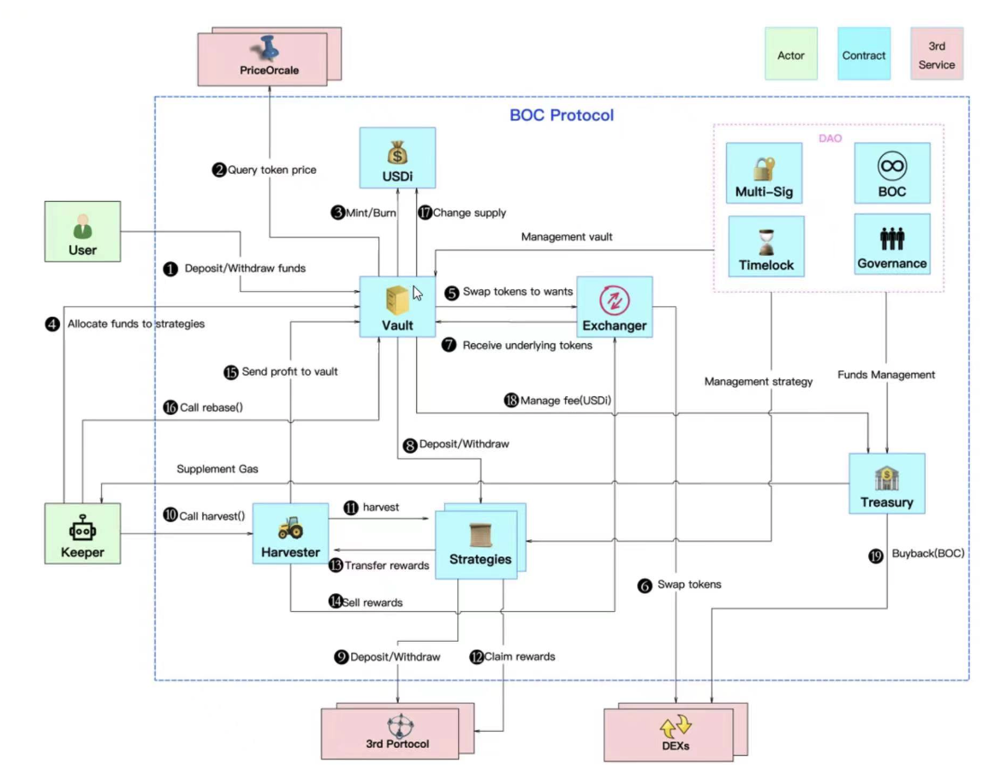

# Diseño del algoritmo del protocolo

## Descripción del proceso

1. "Depositar" - El protocolo BOC permite a los usuarios `depositar` las tres principales stablecoins (USDT, USDC, DAI) en cualquier combinación y en cualquier cantidad, y acuñar USDi de valor correspondiente para devolver al usuario.\
   "Retirar" - Los usuarios pueden `retirar` USDi las tres principales stablecoins en cualquier momento a través del protocolo BOC. Por defecto, se devolverán según la proporción de las tres principales stablecoins en la [Bóveda](https://github.com/Francisco-Rua/boc\_gitbook/blob/es\_version/how-it-works/appendix/README.md#b%C3%B3veda) en ese momento, o pueden especificar una determinada moneda a devolver.
2. Después de que Vault reciba la stablecoin, `queryTokenPrice` consulta el precio de la transferencia del usuario de la [stablecoin](https://github.com/Francisco-Rua/boc\_gitbook/blob/es\_version/how-it-works/appendix/README.md#stablecoin) a través de un oráculo externo. Cuando el precio devuelto por el [oráculo](https://github.com/Francisco-Rua/boc\_gitbook/blob/es\_version/how-it-works/appendix/README.md#or%C3%A1culo) es superior a 1 USD, se calcula a 1 USD, y cuando es inferior a 1 USD, se calcula al precio del [oráculo](https://github.com/Francisco-Rua/boc\_gitbook/blob/es\_version/how-it-works/appendix/README.md#or%C3%A1culo).
3. Basado en el valor calculado, `mint/burn` [mint/burn](https://github.com/Francisco-Rua/boc\_gitbook/blob/es\_version/how-it-works/appendix/README.md#burnmint) un valor equivalente a USDi.
4. El módulo [Keeper](https://github.com/Francisco-Rua/boc\_gitbook/blob/es\_version/how-it-works/appendix/README.md#keeper) alcanza la condición de activación de `doHardWork` y activa `doHardWork`.
5. Vault llama al módulo de intercambio agregado `swapTokenToWants`.
6. El módulo de intercambio agregado `swapTokens` completa el intercambio.
7. Vault recibe la moneda de destino intercambiada por el módulo de intercambio agregado.
8. Vault coloca los `depósitos` de stablecoin en la estrategia según la moneda requerida por la estrategia.
9. La [estrategia](https://github.com/Francisco-Rua/boc\_gitbook/blob/es\_version/how-it-works/appendix/README.md#estrategia) invierte los `depósitos` de stablecoin en protocolos de terceros.
10. El módulo Keeper alcanza la condición de activación de la `cosecha` y activa la `cosecha`.
11. Cosechador desencadena cada estrategia para ejecutar la `cosecha`.
12. Cada estrategia ejecuta `claimRewards` para recoger la minería.
13. Cada estrategia transfiere las monedas de minería `transferRewards` a Harvester.
14. El cosechador vende a los mineros `sellRewards` en stablecoins a través del intercambio agregado.
15. El cosechador `sendProfitToVault` transfiere stablecoins a Vault.
16. El módulo Keeper alcanza la condición de activación `rebase` y activa la `rebase`.
17. Vault llama a `changeTotalSupply` para emitir USDi adicionales.
18. Vault recoge una parte de la recaudación, que se transfiere a la tesorería llamada `Treasury`.
19. La [tesorería](https://github.com/Francisco-Rua/boc\_gitbook/blob/es\_version/how-it-works/appendix/README.md#tesorer%C3%ADa) beneficiará a los usuarios al utilizar `buyback` para recomprar el token de gobierno BOC.

### Reglas de acuñación y quema (burn & mint)

He aquí un ejemplo numérico de acuñación y quema de tokens USDi.

Supongamos que Alicia deposita 100 USDT, 100 DAI y 100 USDC.

Según la regla de acuñación (burn) del BOC: el precio de la transacción es de 1.00 USD cuando el precio de Chainlink es igual o superior a 1.00 USD, de lo contrario el precio de la transacción es igual al precio de [Chainlink](https://chain.link/).

Por lo tanto, Alice "acuñará" 299 USDi en total:

El precio actual de Chainlink es:

* 1 USDT = 1,01 USD
* 1 DAI = 0,99 USD
* 1 USDC = 1.00 USD

100 USDT = 100 x 1.00 = 100 USDi (Chainlink > 1 USD，precio final = 1 USD)\
100 DAI = 100 x 0.99 = 99 USDi (Chainlink < 1 USD，precio final = precio de Chainlink)\
100 USDC = 100 x 1.00 = 100 USDi (Chainlink = 1 USD，precio final = 1 USD)

Ahora, Alice decide `quemar` los USDi para retirar sus stablecoins. Ella tiene 299 USDi y cuando ella quema, dependiendo de la proporción de USDT/USDC/DAI de la Bóveda, el contrato inteligente de quema distribuirá en la misma proporción los USDi en cada stablecoin, en este caso cuando redimimos hay un poco menos de USDT en la Bóveda, por lo que la distribución de cambio será:

* 99 USDi -> USDT
* 100 USDi -> DAI
* 100 USDi -> USDC

Supongamos que el precio actual de Chainlink no cambia.

Precios de Chainlink:

* 1 USDT = 1,01 USD
* 1 DAI = 0,99 USD
* 1 USDC = 1,01 USD

La regla de la quema es opuesta a la de la acuñación: el precio de la transacción es de 1 USD cuando el precio de Chainlink es inferior a 1 USD, de lo contrario el precio de la transacción es igual al precio de Chainlink.

Por lo tanto, Alicia quema 299 USDi para retirar:

100 USDi = 100/1.01 = 99 USDT (Chainlink > 1 USD, precio final = precio de Chainlink)\
100 USDi = 100/1.00 = 100 DAI (Chainlink < 1 USD, precio final = 1 USD)\
100 USDi = 100/1.00 = 100 USDC (Chainlink = 1 USD, precio final = 1 USD)

Los números en el gráfico es solo un ejemplo numérico para entender mejor las reglas de acuñación y quema en BOC. En el mundo real la fluctuación de USDi es mucho menor, lo que significa que los usuarios nunca se encontrarán con una posible pérdida como esta. De hecho, la posible pérdida será inferior al 0,01%. El objetivo de estas reglas es evitar [arbitrajes](https://github.com/Francisco-Rua/boc\_gitbook/blob/es\_version/how-it-works/appendix/README.md#arbitraje) en nuestra plataforma y proteger el protocolo.

## Cosecha

El `harvestTrigger` se activa cada día para determinar si se cumple la condición de `harvest`. Las dos condiciones de cosecha son

1. Se supera el intervalo de tiempo máximo.
2. Se cumple la regla de cosecha:

$$
Beneficio \times 20\% > costo de la cosecha.
$$

Si se cumple alguna de las condiciones anteriores, el usuario puede realizar el trabajo de `harvest`:

1. Ejecutar la cosechadora de transferencia de rendimiento (para la estrategia con producción de rendimiento y alcanzar el umbral de venta de rendimiento);
2. Informar del activo actual de la estrategia.

| Seteo de parámetros                                                                                                                                                                      | ETH                    | Chain BNB              | Polygon                |
| ---------------------------------------------------------------------------------------------------------------------------------------------------------------------------------------- | ---------------------- | ---------------------- | ---------------------- |
| Ciclo de activación de tareas programadas                                                                                                                                                | 6:00 am todos los días | 6:00 am todos los días | 6:00 am todos los días |
| Intervalo de tiempo máximo para activar la estrategia "cosecha" (si el intervalo entre la "cosecha" actual y la última "cosecha" es mayor que este valor, se debe realizar la "cosecha") | 2,5 días               | 2,5 días               | 2,5 días               |
| El factor de relación beneficio-coste X de la estrategia de activación "cosecha" ("cosecha" beneficio>=coste\*X, entonces se puede hacer "cosecha".)                                     | 5                      | 5                      | 5                      |

## Rebase

USDi es un token diseñado de manera que el suministro en circulación se ajusta automáticamente según las fluctuaciones de los precios, este proceso se llama [rebase](https://github.com/Francisco-Rua/boc\_gitbook/blob/es\_version/how-it-works/appendix/README.md#rebase). Al igual que las stablecoins, los tokens rebase suelen estar vinculados a otro activo. Pero en lugar de utilizar las reservas para mantener la vinculación, los tokens rebase automáticamente [queman](https://github.com/Francisco-Rua/boc\_gitbook/blob/es\_version/how-it-works/appendix/README.md#burnmint) tokens en circulación o [acuñan](https://github.com/Francisco-Rua/boc\_gitbook/blob/es\_version/how-it-works/appendix/README.md#burnmint) nuevos tokens. Cuando el total de activos de la Bóveda es mayor que el total de la emisión de USDi, significa que se han generado nuevos ingresos. Después de esto, se revisará el valor de los USDi en comparación con el dólar estadounidense. Cuando el número de USDi aumenta, el valor total de USDi es coherente con el valor total de los activos de la Bóveda, asegurando que 1 USDi está anclado a 1 USD. Al mismo tiempo, el 20% de los USDi adicionales se transferirá a la tesorería como comisión de gestión.

## Asignación de fondos

### doHardWork

La entrada en el ajuste de la posición del algoritmo son el [APY](https://github.com/Francisco-Rua/boc\_gitbook/blob/es\_version/how-it-works/appendix/README.md#inter%C3%A9s-porcentual-anual-apy) oficial del protocolo de terceros, el gas requerido para la inversión de cada estrategia, el límite de [deslizamiento](https://github.com/Francisco-Rua/boc\_gitbook/blob/es\_version/how-it-works/appendix/README.md#slippage) de cambio, y las [reglas de asignación de fondos](https://github.com/Francisco-Rua/boc\_gitbook/blob/es\_version/how-it-works/introduction-to-boc/README.md#reglas-de-asignaci%C3%B3n-de-fondos), y la estrategia y la cantidad de los fondos a invertir son la salida.

| Configurar parámetros                                                                                               | ETH                                | BNB Chain                  | Polygon                       |
| ------------------------------------------------------------------------------------------------------------------- | ---------------------------------- | -------------------------- | ----------------------------- |
| Ciclo de activación de tareas programadas                                                                           | 7 am todos los miércoles y sábados | 7h cada miércoles y sábado | 7 am cada miércoles y sábado. |
| Periodo de cálculo coste-beneficio X (Si el beneficio de la inversión X días >= coste, se puede hacer "doHardwork") | 365 días                           | 365 días                   | 365 días                      |

### Asignación

En comparación con `doHardWork`, `allocation` ha hecho un paso más: sacar los fondos de la estrategia de bajo APY, y luego utilizar el APY oficial del contrato de terceros, el gas requerido para la inversión de cada estrategia, el límite de deslizamiento de cambio, las reglas de asignación de fondos, el algoritmo de ajuste de posición como una entrada, y la salida es la estrategia y la cantidad de los fondos de inversión en espera.

| Establecer parámetros                                                                                                         | ETH                    | Cadena BNB             | Polygon                |
| ----------------------------------------------------------------------------------------------------------------------------- | ---------------------- | ---------------------- | ---------------------- |
| Ciclo de activación de informes de posición preajustado                                                                       | 6:50 am todos los días | 6:50 am todos los días | 6:50 am todos los días |
| Ciclo de activación de la tarea programada: 7 de la mañana todos los lunes.                                                   |                        |                        |                        |
| Periodo de cálculo de coste-beneficio X (Si el beneficio del reequilibrio X días >= coste, se puede realizar la "asignación") | 30 días                | 30 días                | 30 días                |

### Algoritmo de asignación de fondos

| Variable       | Meaning                                                                                                                                                                                                                                        |
| -------------- | ---------------------------------------------------------------------------------------------------------------------------------------------------------------------------------------------------------------------------------------------- |
| "durationDays" | El ciclo de reequilibrio debe garantizar que en un ciclo después del reequilibrio, el beneficio después del reequilibrio - el beneficio antes del reequilibrio - el coste del reequilibrio > 0                                                 |
| "yearDays"     | 365 días                                                                                                                                                                                                                                       |
| "asset1"       | Los activos originales de la estrategia                                                                                                                                                                                                        |
| "apr1"         | El apr de la estrategia antes del ajuste de la posición (el APY necesita ser convertido en apr), el valor actual del APY del algoritmo de ajuste de la posición es el promedio de 7 días del APY calculado fuera de la cadena de la estrategia |
| "deltaAsset"   | Asumir el valor de cambio de capital del rebalanceo de la estrategia                                                                                                                                                                           |
| "poolAssets1"  | El TVL del pool de inversión objetivo estratégico se utiliza como parámetro para el cambio de apr después del ajuste de la posición                                                                                                            |

Beneficio antes del ajuste de la posición

$$
gain1 = \frac{asset1 \times apr1 \times durationDays}{yearDays}
$$

Cambios en los ingresos

$$
gain2 = \frac{ (asset1+deltaAsset-exchangeLoss)\times apr2 \times durationDays}{yearDays}
$$

Cambio apr

$$
apr2 = \frac{apr1 \times poolAssets1}{(poolAssets1+deltaAsset-exchangeLoss)}
$$

Después de sustituir apr2 en gain2 utilizando la ecuación anterior:

$$
gain2=\frac{apr1 \times durationDays/yearDays \times (asset1+deltaAsset) \times poolAssets1}{poolAssets1+deltaAsset-exchangeLoss}
$$

Entonces, la relación entre los ingresos cambiados de una sola estrategia y los activos cambiados es:

$$
deltaGain = gain2-gain1 = \frac{deltaAsset \times (poolAsset1-asset1) \times apr1 \times durationDays}{(poolAsset1+deltaAsset-exchangeLoss) \times yearDays}
$$

Coste del cambio de fondos para una sola estrategia

| Nombre de la variable                                 | Detalles                                                                                                       |
| ----------------------------------------------------- | -------------------------------------------------------------------------------------------------------------- |
| "withdrawFee"                                         | Comisión de gestión de fondos de retirada                                                                      |
| "lendFee"                                             | Tasa de operación de capital adicional                                                                         |
| "exchangeLoss": Pérdida por deslizamiento de divisas. |                                                                                                                |
| "harvestFee"                                          | Comisiones de financiación "harvest"                                                                           |
| "profitChangeFee"                                     | Coste de cambio de capital                                                                                     |
| "withdrawGas"                                         | "withdrawGas" es el gas consumido por la operación de "retirada", que se estima por medio de una prueba previa |
| "lendGas"                                             | es el gas consumido por la operación "lend", que se estima mediante una prueba previa.                         |
| "exchangeLossRate"                                    | Redeem Slippage                                                                                                |

$$
profitChangeFee=withdrawFee+lendFee+exchangeLoss+harvestFee
$$

$$
withdrawFee = gasPrice \times withdrawGas
$$

$$
lendFee= gasPrice \times lendGas
$$

$$
exchangeLoss=deltaAsset \times exchangeLossRate
$$

$$
harvestFee=harvestGas \times durationDays
$$

Encuentra la suma máxima de deltaGain para todas las estrategias:

$$
profitChange=MAX\sum_{i=1}^m(deltaGain_i -withdrawFee_i-lendFee_i - exchangeLoss_i-harvestFee_i)
$$

$$
profitChange=MAX\sum_{i=1}^m(\frac{deltaAsset_i \times (poolAsset_i-asset_i) \times apr_i * durationDays_i}{(poolAsset_i+deltaAsset_i-exchangeLoss_i) \times yearDays_i}
$$

$$
- operateFee_i - exchangeLoss_i - harvestFee_i)
$$

Cambio total Beneficio CambioBeneficio En esta fórmula, la única variable es el deltaAsset para cada estrategia. Al mismo tiempo, la solución debe estar limitada por

Restricciones

1. Los fondos de la misma estrategia de protocolo (restricciones múltiples) no superan el 30% de los fondos totales
2. La suma de todas las entradas y salidas de activos es 0

Condiciones límite

1. Los activos estratégicos no pueden superar el 20% de los activos totales
2. Los fondos estratégicos no pueden superar el 50% de los activos del pool objetivo

Utilice el programa `optimize.minimize` de python para encontrar el esquema de rebalanceo óptimo actual.

### Configuración de los parámetros públicos

| Establecer parámetros                                                                                                            | ETH   | Cadena BNB | Polygon  |
| -------------------------------------------------------------------------------------------------------------------------------- | ----- | ---------- | -------- |
| Cálculo de la asignación de fondos Configuración del deslizamiento de la bolsa                                                   | 0,25% | 0,25%      | 0,25%    |
| Configuración del gas (incluyendo el gas de depósito y retirada de la estrategia, el gas de intercambio, el coste de la cosecha) |       | Gas real   | Gas real |

### Reglas de cálculo del APY oficial

Los APY oficiales son necesarios como referencia a la hora de asignar fondos. Las fuentes de APY oficiales son las siguientes: vfat.tools, coingecko, zapper, Official APY, apy.vision Fee, etc. Si el canal de la fuente del APY oficial no incluye el cálculo del APY de la estrategia de protocolo, el BOC copia directamente las reglas de cálculo del APY oficial de la estrategia de protocolo. En general, el APY oficial de la estrategia de protocolo se compone de los ingresos de creación de mercado y de los ingresos de las monedas mineras. Tomando la estrategia "ConvexLusdStrategy" que BOC ya ha acoplado como ejemplo, su APY consiste en el contenido de la siguiente tabla:

.

| Marca APY    | APR         | APY              | Interés compuesto | Método de cálculo    | Fuente de datos                                                                                             |
| ------------ | ----------- | ---------------- | ----------------- | -------------------- | ----------------------------------------------------------------------------------------------------------- |
| Cuota de Trx | 0,0024      | Tasa de Tx       | N                 | API                  | https://www.convexfinance.com/api/curve-apys                                                                |
| crv          | 0,023523458 | cvx mining coins | Y                 | API                  | https://www.convexfinance.com/api/curve-apys                                                                |
| cvx          | 0,024132445 | cvx mining coins | Y                 | Cálculo del contrato | En función del tiempo, el precio de las monedas mineras a un año/activos totales del pool puede obtener TAE |

$$
APY=(1+APR)^{periods}-1
$$

El parámetro "periods" es el periodo de pago de intereses.

### Reglas de cálculo del APY real de la estrategia

El APY real de la estrategia se calcula con base en la rentabilidad estándar de la moneda de la estrategia.
