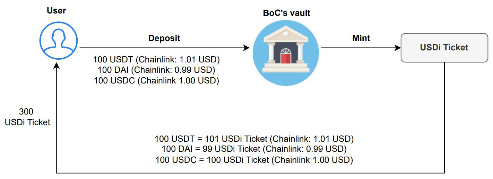
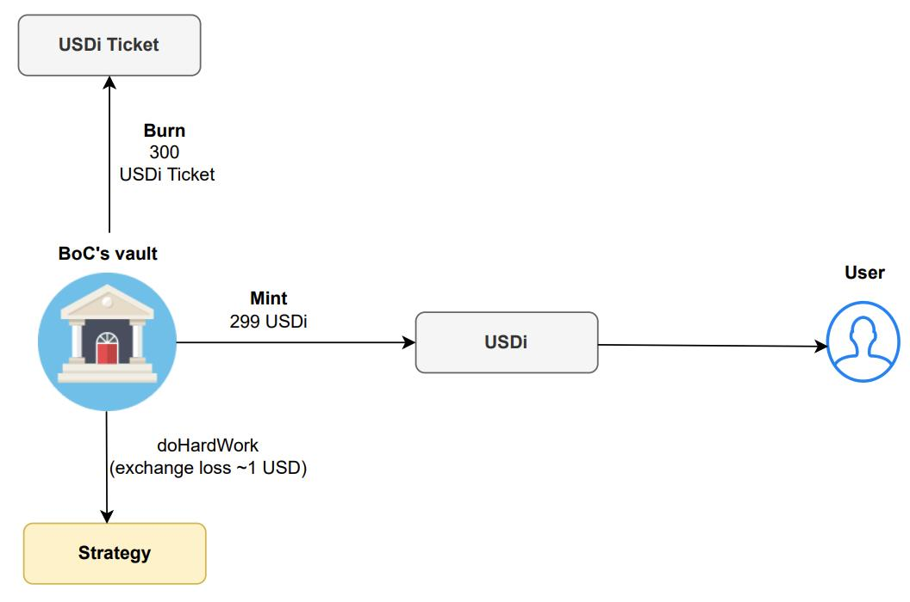
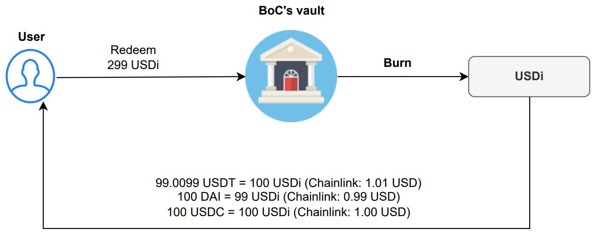

# Mint & Burn rules

<figure><figcaption>
Figure 1: BoC vault minting USDi Ticket after the user has deposited stablecoins.
</figcaption></figure>

Figure 1 depicts a flowchart of the rules involved when users deposit stablecoins and the equivalent amount of USDi Ticket is minted.

The user can deposit three major stablecoins (USDT, USDC, DAI) in any combination and in any amount. According to the current price of the oracle Chainlink, the equivalent amount of USDi Ticket will be minted as the proof of funds held.

Assume that Alice deposits 100 USDT, 100 DAI and 100 USDC.

Assuming that the current price on Chainlink is now:

* 1 USDT = 1.01 USD
* 1 DAI = 0.99 USD
* 1 USDC = 1.00 USD

According to the BoC **mint rule**:&#x20;

The transaction price is equal to the price on Chainlink.

Thus, Alice will `mint` 300 USDi Ticket in total:

* 100 USDT = 100 x 1.01 = 101 USDi Ticket
* 100 DAI = 100 x 0.99 = 99 USDi Ticket
* 100 USDC = 100 x 1.00 = 100 USDi Ticket

<figure><figcaption>
Figure 2: After allocating funds onto third-party strategies, BoC vault burns USDi Ticket and mint USDi to be distributed to users.
</figcaption></figure>

According to the doHardWork strategy algorithm, the stablecoins deposited by users are combined and invested into relevant strategies. According to the valuation of the strategy after this investment, the equivalent value of USDi is minted as the final investment proof to be held by the user while the USDi Ticket held previously will be burnt.

The situation is depicted using Alice's case. Assuming that the 300 USDi held by Alice corresponds to the 100 USDT, DAI and USDC invested respectively, after the doHardWork strategy algorithm, it is invested in the Aura3PoolStrategy strategy protocol, and its final valuation is 299 USD (the loss \[1 USD in this context] is generally due to proportional tokens exchange, whereas some protocols also charge for admission fees). The user will eventually get 299 USDi and the 300 USDi Ticket held previously will be burnt.

<figure><figcaption>
Figure 3: Burn USDi
</figcaption></figure>

According to the rule of burning:

$$
Current USDi ExchangeRate=\frac{Current VaultTotalAsset}{CurrentTotalUSDiIssuance}
$$

According to the current USDi exchange rate, the stablecoin of equivalent value will be exchanged. The value of the exchanged stablecoin (transaction price) follows the current price of the oracle Chainlink.

Now, Alice decides to `burn` the 299 USDi to withdraw her stablecoins.&#x20;

Assuming the current USDi Exchange Rate is 1.000, and current Chainlink prices are:

* 1 USDT = 1.01 USD
* 1 DAI = 0.99 USD
* 1 USDC = 1.01 USD

If all 299 USDi are burnt for USDT, the amount obtained will be $$\frac{299}{1.01}=296.0396$$​ USDT;

If all 299 USDi are burnt for DAI, the amount obtained will be $$\frac{299}{0.99}=302.0202$$​ DAI;

If all 299 USDi are burnt for USDC, the amount obtained will be $$\frac{299}{1.00}=299.0000$$​ USDC;

That is, the value of the exchanged stablecoin (calculated according to the current price of the oracle Chainlink) which is equivalent to the value of the USDi burnt (held previously) \[Total USDi burnt $$\times$$​ Current USDi Exchange Rate]&#x20;

**Note:** The numbers in the chart here are only numerical examples for a better understanding of the rules of minting and burning in BoC. In reality, the fluctuation of USDi is much smaller, indicating that users will never encounter such possible loss. In fact, the possible loss here will be less than 0.01%.&#x20;
