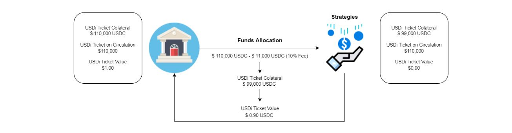

# USDi Ticket

In the Alpha version, the first allocation fee for every deposit will be shared out by all users in the vault, depending on their proportion of the amount deposited. However, this analogously indicates that the first allocation fee of one user will also be borne by all other users including those who have previously deposited into the vault. So, the Beta version will include a new concept "USDi Ticket"  which is designed as a buffer that avoids USDi holders from being affected by new deposits on the protocol. Let's see both scenarios for a better explanation:&#x20;

To simplify the situation for easier understanding:

* Assume that the users only deposit in USDC
* The price on Chainlink is now `1 USDC = 1 USD`.&#x20;
* The vault is currently having only one user (James) who holds 100k USDi.&#x20;
* The allocation fee is 10% to look better at the impacts (in reality is less than 1%).

### Alpha version logic (without USDi ticket).

We have James, he is holding at the moment  `T=0` $ 100,000 USDi being USDi a fully pegged to USD (1 USDi = 1 USD), so his total assets on USD is $100,00 USD.

<figure><figcaption>
Starting point T=0 (Alpha version).
</figcaption></figure>

Yesterday, Alice deposited 100,000 USDC as well, while Bob deposited 10,000 USDC. So, the vault will mint 110,000 USDi and they will be receiving 100,000 USDi and 10,000 USDi respectively.&#x20;

<figure><figcaption>
Alice and Bob deposit new funds on BoC protocol (Alpha version).
</figcaption></figure>

The keeper will call the funds allocation when the [conditions](protocol-algorithm-design.md#allocation) are met and the vault will allocate the fund on the strategies selected by the keeper. For this feed will be needed to pay on the 3rt party protocols to complete the allocation, this fee will be taken from the USDi collateral, causing a de-pegging.

<figure><figcaption>
Allocation of the funds T=1 (Alpha version). 
</figcaption></figure>

<figure><figcaption></figcaption></figure>

As we can see in the table, the fund allocation decreases the USDi collateral causing a de-pegging of it vs USD where James' assets have been affected by Alices' and Bob's deposit.

<figure><figcaption>
User's assets after allocation (Alpha version). 
</figcaption></figure>

### Beta version logic (with USDi ticket).

The Beta version is incorporated USDi ticket functions as a buffer for the dispatching of the USDi. It could also be understood as a parallel USDi. After depositing stablecoins into the vault,  the user holds USDi tickets until the fund allocation has been completed by the protocol, and then only USDi will be distributed to the user. This allows the first allocation fees to be transparent and visible, which is the difference between the USDi tickets held by the user and the USDi distributed afterward.

We simplify again the situation for easier understanding:

* Assume that the users only deposit in USDC
* The price on Chainlink is now `1 USDC = 1 USD`.&#x20;
* The vault is currently having only one user (James) who holds 100k USDi.&#x20;
* The allocation fee is 10% to look better at the impacts (in reality is less than 1%).

Again, we have James, he is holding at the moment  `T=0` $ 100,000 USDi being USDi a fully pegged to USD (1 USDi = 1 USD), so his total assets on USD is $100,00 USD.

<figure><figcaption>
Starting point T=0 (Beta version).
</figcaption></figure>

In this situation, Alice deposited 100,000 USDC as well, while Bob deposited 10,000 USDC. So, on the Beta version, the vault will mint 110,000 **USDi Tickets** and they will be receiving 100,000 USDi and 10,000 USDi respectively.&#x20;

<figure><figcaption>
Alice and Bob deposit new funds on BoC protocol (Beta version).
</figcaption></figure>

The keeper will call the funds allocation when the [conditions](protocol-algorithm-design.md#allocation) are met and the vault will allocate the fund on the strategies selected by the keeper. For this feed will be needed to pay on the 3rt party protocols to complete the allocation, this fee will be taken from the USDi collateral, causing a de-pegging.

<figure><figcaption>
Allocation of the funds T=1 (Beta version). 
</figcaption></figure>

After the fund's allocation, the vault will exchange the USDi Tickets (burn) for USDi (mint).

<figure><figcaption>
USDi ticket exchange (Beta Version).
</figcaption></figure>

<figure><figcaption></figcaption></figure>

As we can see in the table, the fund allocation decreases the USDi Ticket collateral causing a de-pegging of it vs USD but USDi collateral remains untouched and fully pegged to USD, so, James' assets have not been affected by Alices' and Bob's deposit.

<figure><figcaption>
User's assets after allocation (Beta version). 
</figcaption></figure>

