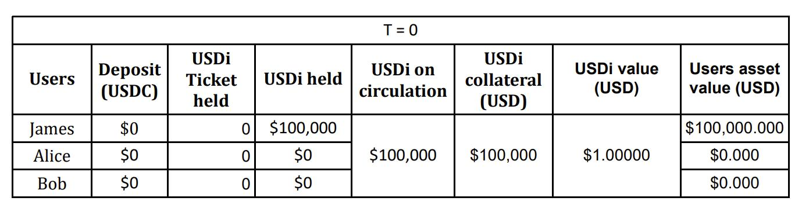
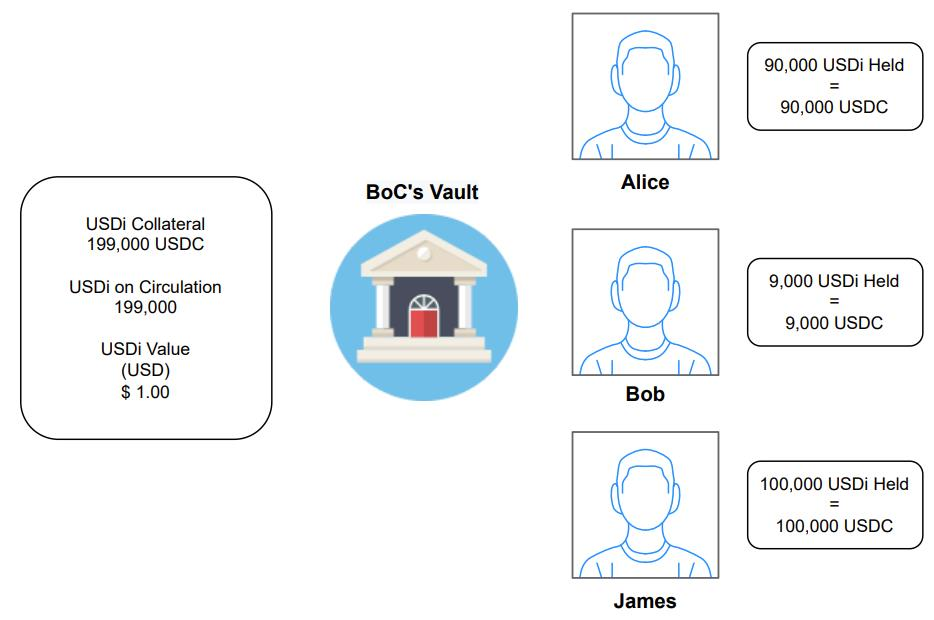

# USDi Ticket

In the Alpha version, the first allocation fee for every deposit will be shared out by all users in the vault, depending on their proportion of the amount deposited. However, this analogously indicates that the first allocation fee of one user will also be borne by all other users including those who have previously deposited into the vault. To resolve this issue, the Beta version will include a new concept "USDi Ticket" which is designed as a buffer that avoids current USDi holders from being affected by new deposits into the protocol. Let's see both scenarios for a better visualization:

To simplify the situation for easier understanding:

* Assume that the users only deposit in USDC.
* The price on Chainlink is now `1 USDC = 1 USD`.
* The vault is currently having only one user (James) who holds 100k USDi.
* The allocation fee is 10% to have more significant impacts on the figures (In reality would be less than 1%, normally around 0.03%).

### Alpha version logic (without USDi ticket).

At `T=0`, We have James, who is holding at the moment $ 100,000 USDi, having USDi to be fully pegged to USD (1 USDi = 1 USD), so his total assets in USD is $100,000 USD.

<figure><figcaption>
Table 1: T=0 (Alpha version)
</figcaption></figure>

<figure><figcaption>
Diagram 1: Starting point at T=0 (Alpha version).
</figcaption></figure>

Yesterday, Alice deposited 100,000 USDC as well, while Bob deposited 10,000 USDC. Thus, the vault will mint 110,000 USDi and they will be receiving 100,000 USDi and 10,000 USDi respectively.

<figure><figcaption>
Table 2: T=1 (Alpha version)
</figcaption></figure>

Alice and Bob deposit new funds into the BoC protocol (Alpha version).

The protocol mints the corresponding amount of USDi to users as shown in Diagram 2:

<figure><figcaption>
Diagram 2: USDi minted to users.
</figcaption></figure>

The keeper will call the funds allocation when the [conditions](protocol-algorithm-design.md#allocation) are met and the vault will allocate the funds on the strategies selected by the keeper. For this fees will be needed to pay the third-party protocols to complete the allocation. This fee will be taken from the USDi collateral, causing de-pegging.

<figure><figcaption>
Diagram 3: Allocation of funds at T=1 (Alpha version).
</figcaption></figure>

As we can see in the table, the fund allocation decreases the USDi collateral causing a de-pegging of it vs the USD for which James' assets have also been affected by Alices' and Bob's deposit, which is unreasonable.

<figure><figcaption>
Diagram 4: User's assets after fund allocation (Alpha version).
</figcaption></figure>

### Beta version logic (with USDi Ticket).

The Beta version is incorporated with the USDi Ticket which functions as a buffer for the dispatching of the USDi. It could also be understood as a parallel USDi. After depositing stablecoins into the vault, the user holds USDi Tickets until the fund allocation has been completed by the protocol, and then only USDi will be distributed to the user. This allows the first allocation fees to be transparent and visible, which is the difference between the USDi tickets held by the user and the USDi distributed afterward.

We simplify again the situation for easier understanding:

* Assume that the users only deposit in USDC.
* The price on Chainlink is now `1 USDC = 1 USD`.
* The vault is currently having only one user (James) who holds 100k USDi.
* The allocation fee is 10% to have more significant impacts on the figures (In reality would be less than 1%, normally around 0.03%).

Again at `T=0`, we have James, who is holding at the moment $ 100,000 USDi having USDi to be fully pegged to USD (1 USDi = 1 USD), so his total assets in USD is $100,000 USD.

<figure><figcaption>
Table 3: T=0 (Beta version)
</figcaption></figure>

<figure><figcaption>
Diagram 5: Starting point T=0 (Beta version)
</figcaption></figure>

In this situation, Alice deposited 100,000 USDC as well, while Bob deposited 10,000 USDC. Thus, on the Beta version, the vault will mint 110,000 **USDi Tickets** and they will be receiving 100,000 USDi Tickets and 10,000 USDi Tickets respectively.

<figure><figcaption>
Table 4: T=1 (Beta version)
</figcaption></figure>

<figure><figcaption>
Diagram 6: Alice and Bob deposit new funds on the BoC protocol (Beta version).
</figcaption></figure>

The keeper will call the funds allocation when the [conditions](protocol-algorithm-design.md#allocation) are met and the vault will allocate the funds on the strategies selected by the keeper. For this fees will be needed to pay the third-party protocols to complete the allocation, this fees will be taken from the USDi collateral, causing de-pegging.

<figure><figcaption>
Diagram 7: Allocation of the funds T=1 (Beta version).
</figcaption></figure>

After the funds allocation, the vault will exchange the USDi Tickets (burn) for USDi (mint).

<figure><figcaption>
Diagram 8: USDi ticket exchange (Beta version).
</figcaption></figure>

As we can see in the table, the fund allocation decreases the USDi Ticket collateral causing a de-pegging of it vs the USD, however the USDi collateral remains unaffected and fully pegged to USD, so James' assets have not been affected by Alices' and Bob's deposit.

<figure><figcaption>
Diagram 9: User's assets after allocation (Beta version).
</figcaption></figure>

In conclusion, the main function of **USDi Tickets** is to **solve the over-dispatching of USDi** (without deducting the first allocation fee). It also **allows transparency of the first allocation fee** to be borne by every user individually.&#x20;
