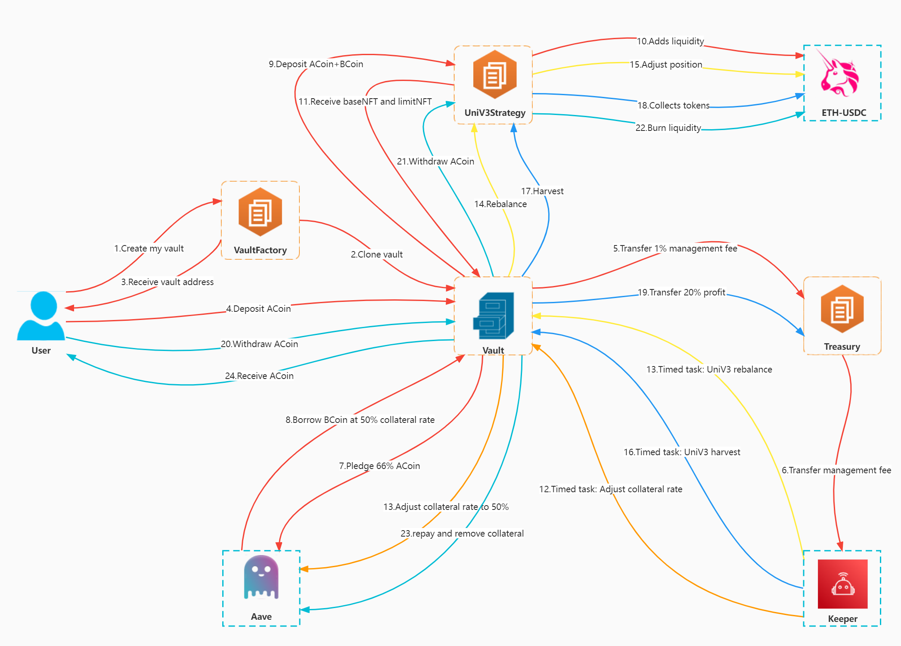

# Risk On Strategy


Note: The risk on strategy is currently under development and optimization. The content of the latest version will be continuously updated.


<figure><figcaption>
Figure 1: Risk on strategy flow map.
</figcaption></figure>

### Risk On Strategy Description:

1. There are two types of assets, which is ETH and USDC. After the user deposits Asset A, a separate Vault will be created for the user \[similar to MakerDao's Collateralized Debt Position (CDP) ].
2. Every portion of Asset A will be split into 33% and 66%, 1% is used as management fee to pay for the Gas needed for rebalancing.
3. 66% of Asset A borrows Asset B which is of equal value to that 33% from AAVE at a 50% mortgage rate.
4. Construct Uniswap V3 USDC-ETH 500 LP with 33% of Asset A and 33% of Asset B, and make market based on BoC's Uniswap V3 algorithm.
5. When the mortgage rate rises to 75% (Asset A falls by 33%), return a partial of Asset B from LP, reduce the mortgage rate to 50%, continue market making.
6. When the mortgage rate is reduced to 37.5% (Asset A increases by 33%), borrow more Asset B to join LP, increase the mortgage rate to 50%, continue market making.
7. When the market making returns are less than twice the AAVE lending rate, market making will be suspended.

### Risk On Strategy Market Making Report

1. $$Net Market Making Funds = Cumulative Invested Funds - Withdrawn Funds (Asset A)$$
2. AAVE outstanding loan principal and interest (Asset B).
3. AAVE Mortgage Fund (Asset A).
4. Uniswap LP Token net value (valued in Asset A).
5. Market making profit $$(4+3) - (2+1)$$.
6. Calculate IRR (different from APY).

Reserve 20% of the profits as the switch to enter Treasury.
