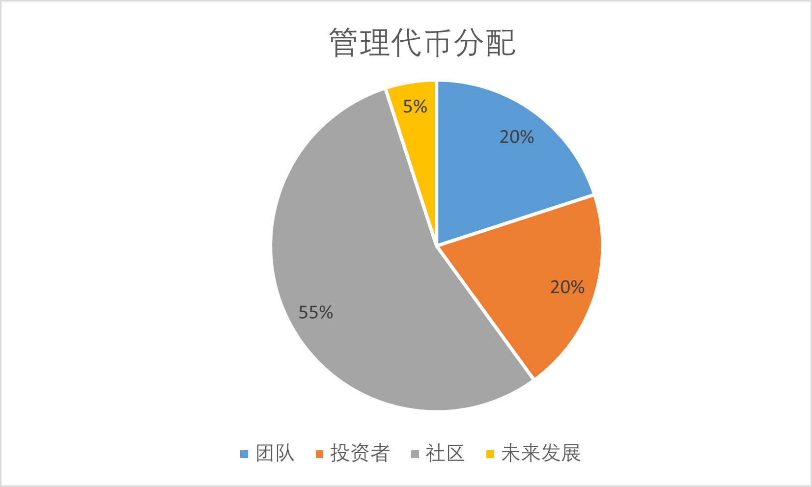

# 审计与治理

BOC是一个颠覆性的区块链创新协议，旨在改变加密投资行业的生态系统，它将成为资产贷款人和投资运营商之间的桥梁。BOC的应用领域极为广泛，希望能创造一个全新的、互联的加密投资世界。

## DAO规划

目前，BOC的治理是通过Gnosis多签实现共同管理。后续将会把治理权转移到DAO。DAO计划将根据以下方向进行不断迭代：

1. DAO使用 治理论坛Habor 和 Snapshot 进行链下投票和链上智能合约的执行提议。 点击加入：\
   BOC [Snapshot](https://snapshot.org/#/bankofchain.eth)\
   BOC [Habor](https://governance.bankofchain.io/)
2. [治理代币](../more/appendix.md#治理币governance-token)正在开发中。

### 代币经济学

BOC计划发行代币10亿枚。代币持有者将根据持有比例获得BOC管理费用收入。代币锁定后可以参与治理并共享收益。具体的代币拟按以下4部分发放：团队、投资者、社区以及预留部分。

| **团队（第一年10%，第二年20%，第三年30%，第四年40%）**  | **20.0%** | **2亿**   |
| ------------------------------------ | --------- | -------- |
| 技术团队                                 | 10%       | 1亿       |
| 营销                                   | 2%        | 0.2亿     |
| 创始人                                  | 8%        | 0.8亿     |
| **投资者（第一年10%，第二年20%，第三年30%，第四年40%）** | **20%**   | **2亿**   |
| **社区**                               | **55%**   | **5.5亿** |
| 提供流动性（在Balancer提供美元交易，为期12个月）        | 5%        | 0.5亿     |
| 流动性挖矿（前期投资者收益增强，为期12个月）              | 50%       | 5.0亿     |
| **未来发展**                             | **5%**    | **0.5亿** |
| 团队（未来招募新加入团队）                        | 3%        | 0.3亿     |
| 顾问（行业内有影响的重要人士）                      | 2%        | 0.2亿     |
| **合计**                               | **100%**  | **10亿**  |

## 审计

所有BOC智能合约均由独立实验室（例如SlowMist等）进行审计。

## Bug赏金计划

通过与第三方的合作，我们将在社区建立一种新模式，以帮助和提高所用智能合约质量。目前考虑的第三方组织包括Premier Bug Bounty Platform 和 DeFi Project，其内有专业安全研究人员审查代码、披露漏洞、获得报酬，并使BOC的智能合约更安全。
