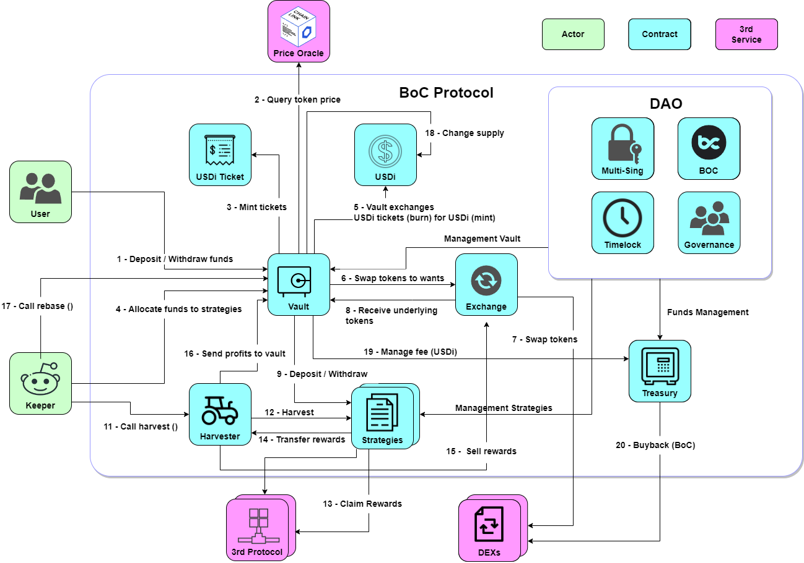

# 协议算法设计

## 总体流程说明

BoC目前提供 **USD耕种理财** 和 **ETH耕种理财**。

### USD理财:

<figure><figcaption></figcaption></figure>

1.
   * **存入`deposit`**：BoC协议支持用户将手中的三大稳定币（USDT、USDC、DAI）以任意组合、任意数量的形式存入，并`mint`出相应价值的USDi返回给用户。
   * **取出`withdraw`**：用户可以随时将USDi通过BoC协议换回三大稳定币，BoC将按照当时Vault中三大稳定币的比例进行返回，也可以指定返回某一种币，并`burn`相应价值USDi。
2. Vault接收到稳定币后通过外部预言机`queryTokenPrice`查询用户转入稳定币的价格（预言机返回的价格高于1USD时按1USD算，低于1USD时按预言机价格算）。
3. 根据计算出来的价值，`mint/burn`铸造/销毁等量价值的USDi。
4. Keeper模块到达`doHardWork`触发条件，触发`doHardWork`。
5. 在 keeper 触发 `doHardWork` 之后，vault 将进行资金调配，接着将 USDi Ticket （销毁）兑换成 USDi（铸造）。
6. Vault调用聚合兑换模块`swapTokenToWants`。
7. 聚合兑换模块`swapTokens`完成兑换。
8. Vault接收到聚合兑换模块兑换出的目标币种。
9. Vault按照策略需要的币种将稳定币`deposit`投入策略中。
10. 策略将稳定币`deposit`投入到第三方协议。
11. Keeper模块到达`harvest`触发条件，触发`harvest`。
12. Harvester触发各个策略执行`harvest`。
13. 各策略执行`claimRewards`收矿。
14. 各策略将矿币`transferRewards`转移到Harvester。
15. Harvester通过聚合兑换将矿币`sellRewards`卖成稳定币。
16. Harvester`sendProfitToVault`将稳定币转移到Vault中。
17. Keeper模块到达`rebase`触发条件，触发`rebase`。
18. Vault调用`changeTotalSupply`增发USDi。
19. Vault收取20%收益，转移到国库`Treasury`。
20. 国库将收益用户`buyback`回购BOC治理代币。

### ETH理财

USD稳定币耕种的抵押凭证为USDi；EHT理财耕种的抵押凭证则为EHTi。

总的来说，ETH 耕种理财机制与 USD 稳定币耕种理财机制大致相同。但是有一些细微的差异，如下所示：

1. &#x20;ETHi不是由Harvester进行统一收矿、复投，而是各个策略单独卖矿复投的。
2. `queryTokenPrice`时，虽然币种都会依据Chainlink上的价格，但部分币种并没有chainlink的报价。在这种情况下，用的则是Uniswap-V3的TWAP的1小时的加权平均价格。


[usdi-ticket.md](usdi-ticket.md)



[zhu-zao-mint-xiao-hui-burn-gui-ze.md](zhu-zao-mint-xiao-hui-burn-gui-ze.md)



[shou-ge-harvest.md](shou-ge-harvest.md)



[rebase.md](rebase.md)



[zi-jin-tiao-pei.md](zi-jin-tiao-pei.md)

