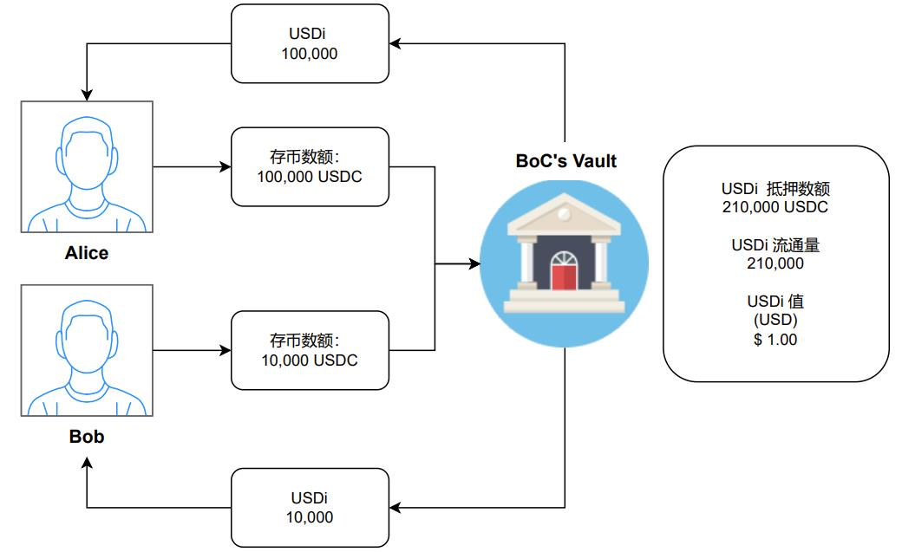
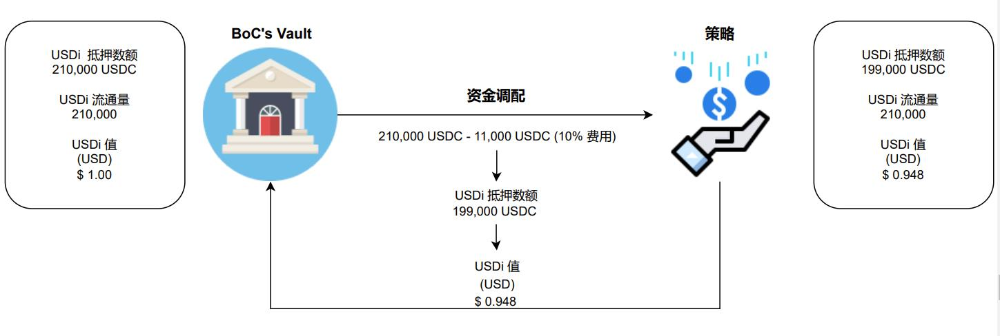
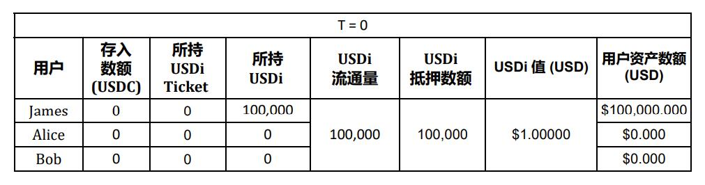
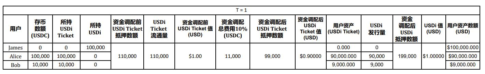
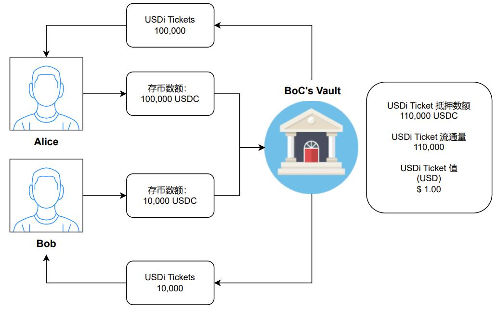

# USDi Ticket

在内测版中，每次投资所需的首次分配费用将被合并到机枪池总估值中一起计算，意味着费用将由当前机枪池中所有用户一并承担，而各个用户所承担的费用将由其所投资的资金比例决定。这相当于当一个新用户投入资金，该用户所承担的调配费用也将由早期已投资的用户一起承担。为了解决这个问题，BoC 公测版将包含一个新概念 “USDi Ticket” 作为缓冲器，以避免当前 USDi 持有者（早期投资用户）受到新投资的影响。 让我们通过以下两种场景以获得更好的可视化效果：

为了简化情况以便于理解：

* 假设用户只存入USDC。
* Chainlink 预言机价格为`1 USDC = 1 USD`。
* 当前 vault 中只有一个已投资用户（James），该用户持有 100k USDi。
* 假设资金调配费用为投入资金的 10%，以对计算数额产生更显著的影响，更好理解。（现实中调配费用少于1%，一般约 0.03%）

### 内测版（Alpha version）逻辑原理（无 USDi Ticket)

`T=0` 时，James 作为早期投资用户，当前持有USDi数额为 $ 100,000，该USDi 和 USD 当前 1:1 锚定（1 USDi = 1 USD），故此他的当前总资产为 $100,000 USD。

<figure><figcaption>
表格1：T=0 (内测版）
</figcaption></figure>

注：

* 当用户投入 USDC，vault将铸造 USDi 并发行给用户，这时 USDi 被视为 vault给予用户的 “抵押品”，故 “抵押数额”。
* 当 vault 发行 USDi，意味着 USDi 开始流通，即 ”流通量“。

<figure><figcaption>
图1：起始点 T=0 （内测版）
</figcaption></figure>

昨日，Alice 投资了 100,000 USDC 而 Bob 则投资了 10,000 USDC。这时 vault 将铸造 110,000 USDi ，Alice 和 Bob 分别接收到 100,000 USDi 和 10,000 USDi。

<figure><figcaption>
表格2：T=1 （内测版）
</figcaption></figure>

在 Alice 和 Bob存币到 BoC 协议（内测版）中之后，协议将铸造相对数额的 USDi 并发行给用户，如图2所示：

<figure><figcaption>
图2：铸造USDi并发行给用户
</figcaption></figure>

当所有条件都符合，keeper 将呼叫执行资金调配，将资金调配到被keeper指定的策略中。首次资金调配将需要抽取一笔调配费用支付第三方协议以完成调配。这个费用将从 USDi 抵押数额中抽取，进而造成脱钩。

<figure><figcaption>
图3：T=1时进行资金调配（内测版）
</figcaption></figure>

如表格2中所示，资金调配将导致 USDi 抵押数额减少，进而造成与 USD 脱钩（USDi : USD比例不再为 1:1)。脱钩之后，就会出现早期用户资产受影响的现象，如此例子，就是James的总资产在Alice 和 Bob投资时莫名减少了，而这是不合理的。

<figure><figcaption>
图4：资金调配后用户总资产（内测版）
</figcaption></figure>

### 公测版逻辑原理（有 USDi Ticket)

在公测版中，USDi ticket将成为发行USDi的缓冲器，也可以被理解成USDi的平行币。用户将稳定币投入机枪池后，将持有相对应的USDi ticket直到协议完成资金调配，该USDi ticket才会被兑换成USDi并发行。这样的操作才能使首次调配费用可视化以及透明化，即为用户所持有USDi ticket，以及所发行的USDi之间的差：

$$
首次调配费用=所持有(USDi) ticket-所发行USDi
$$

再次简化情况以便于理解：

* 假设用户只存入USDC。
* Chainlink 预言机价格为`1 USDC = 1 USD`。
* 当前 vault 中只有一个已投资用户（James），该用户持有 100k USDi。
* 假设资金调配费用为投入资金的 10%，以对计算数额产生更显著的影响，更好理解。（现实中调配费用少于1%，一般约 0.03%）

`T=0` 时，James 作为早期投资用户，当前持有USDi数额为 $ 100,000，该USDi 和 USD 当前 1:1 锚定（1 USDi = 1 USD），故此他的当前总资产为 $100,000 USD。

<figure><figcaption>
表格3：T=0 （公测版）
</figcaption></figure>

<figure><figcaption>
图5：起始点 T=0（公测版）
</figcaption></figure>

在这个情况下，Alice也投资了 100,000 USDC, 而 Bob 则也投资了 10,000 USDC。故此在公测版中，vault 将铸造 110,000 **USDi Tickets**，Alice 和 Bob将分别接收到 100,000 USDi Tickets 和 10,000 USDi Tickets。

<figure><figcaption>
表格4：T=1（公测版）
</figcaption></figure>

<figure><figcaption>
图6：Alice 和 Bob 投入新资金到 BoC 协议中（公测版）
</figcaption></figure>

当所有条件都符合，keeper 将呼叫执行资金调配，将资金调配到被keeper指定的策略中。首次资金调配将需要抽取一笔调配费用支付第三方协议以完成调配。这个费用将从 USDi Ticket 抵押数额中抽取，进而造成USDi Ticket脱钩，而非USDi。

<figure><figcaption>
图7：T=1 时进行资金调配（公测版）
</figcaption></figure>

资金调配之后，vault将把 USDi Tickets （销毁）兑换成相对数额的 USDi（铸造）。

<figure><figcaption>
图8：兑换USDi Ticket （公测版）
</figcaption></figure>

如表格4中所示，资金调配将导致 USDi Ticket抵押数额减少，进而造成与 USD 脱钩（USDi Ticket: USD比例不再为 1:1)，但与内测版不同，USDi 抵押数额并不受影响，因此USDi 抵押数额依然与 USD 1:1 锚定。如此一来，早期用户（James）的总资产并不会受到 新投资者（Alice 和 Bob）的影响。

<figure><figcaption>
图9：资金调配后用户总资产（公测版）
</figcaption></figure>

总结：**USDi Ticket** 的主要功能是为了**解决 vault 超发 USDi 的现象**（未扣除首次资金调配费用），并且将此**费用透明化**，让所有用户都能清楚每一次投资所需的相对调配费用。&#x20;
