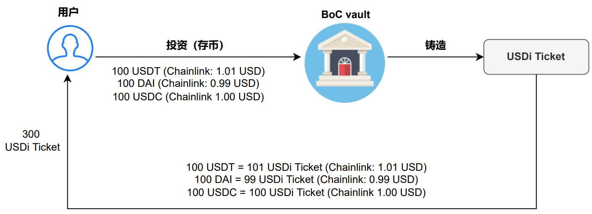
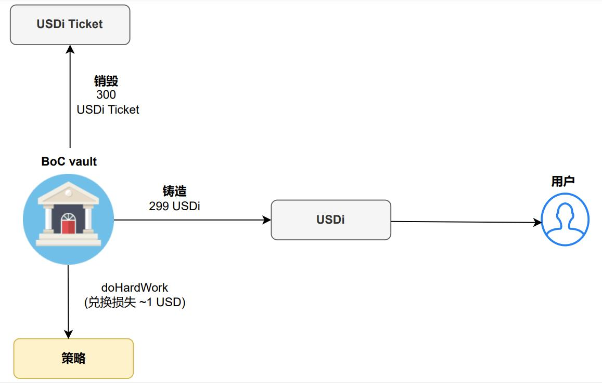

# 铸造(Mint)/销毁(Burn)规则

<figure><figcaption>
图1：BoC vault 在用户投入稳定币后铸造USDi Ticket
</figcaption></figure>

上图为用户存入稳定币并`mint`出等价的USDi Ticket的规则流程图。

用户将手中的三大稳定币（USDT、USDC、DAI）以任意组合、任意数量存入，根据当下预言机Chainlink的价格，铸造出等价的USDi Ticket作为持有资金凭证。

假设用户存入USDT, DAI和USDC各100，此时预言机的价格为：

* 1 USDT = 1.01 USD
* 1 DAI = 0.99 USD
* 1 USDC = 1.00 USD

根据**BoC铸造规则**：

则最终用户能`mint`出300 USDi Ticket ：

* 100 USDT = 100 x 1.01 = 101 USDi Ticket
* 100 DAI = 100 x 0.99 = 99 USDi Ticket
* 100 USDC = 100 x 1.00 = 100 USDi Ticket

<figure><figcaption>
图2：BoC 在把资金调配到第三方策略后销毁USDi Ticket，铸造USDi 并发行给用户
</figcaption></figure>

接着根据dohardwork策略算法,将用户存入的稳定币进行组合投资到相关策略里，根据本次投资后按策略的估值进行铸造出等价的USDi作为用户最终持有的投资凭证，并销毁其持有的USDi Ticket。

假设用户持有的300 USDi，对应投入的各100个USDT, DAI和USDC，经过doHardWork策略算法，将其投入到 Aura3PoolStrategy策略协议，其最终估值为299 USD(损失一般是由于策略投资会进行一定比例的币种兑换或是有的协议会收取入场费造成的)。那么用户最终能得到299 USDi，并将销毁其持有 300 USDi Ticket。

<figure><figcaption>
图3：销毁USDi
</figcaption></figure>

当用户取出池中稳定币时，需要提供并销毁(burn)手上的投资凭证USDi。

根据**BoC销毁规则**：

$$
当前USDi汇率 =\frac {当前vault总资产}{ 当前USDi总量}
$$

根据当前USDi的汇率，兑换出其相等价值的稳定币。兑换出来稳定币的价值是根据当下预言机Chainlink的价格来结算的。

假如用户销毁(burn)手中的299 USDi以取出稳定币

假设当前USDi的汇率是1.000，预言机的价格为：

* 1 USDT = 1.01 USD
* 1 DAI = 0.99 USD
* 1 USDC = 1.00 USD

若全部取出的是USDT，那么数量将为 $$\frac{299}{1.01} = 296.0396$$ USDT;

若全部取出的是DAI，那么数量将为 $$\frac{299}{0.99}=302.0202$$ DAI;

若全部取出的是USDC，那么数量将为$$\frac{299}{1.00}=299.0000$$ USDC;

即兑换出来的稳定币的价值(根据当下预言机Chainlink的价格计算)等价于销毁其持有USDi的价值(销毁USDi数量$$\times$$当下USDi汇率)。

**注：**此页图表中的数字仅为数字示例，用于更好地了解 BoC 中的铸造和销毁规则。实际上，USDi 的波动要小得多，说明用户不会蒙受这么显著的损失。事实上，这里的损失一般将小于 0.01%。
